# Неофициальное, открытое методическое пособие к программе Power BI и надстройкам над Excel Power Query и Power Pivot

<!-- MarkdownTOC autoanchor="false" autolink="true" uri_encoding="true" markdown_preview="github" levels="1,2,3,4" -->

- [Введение](#%25D0%25B2%25D0%25B2%25D0%25B5%25D0%25B4%25D0%25B5%25D0%25BD%25D0%25B8%25D0%25B5)
    - [Предисловие](#%25D0%25BF%25D1%2580%25D0%25B5%25D0%25B4%25D0%25B8%25D1%2581%25D0%25BB%25D0%25BE%25D0%25B2%25D0%25B8%25D0%25B5)
    - [Отказ от ответственности](#%25D0%25BE%25D1%2582%25D0%25BA%25D0%25B0%25D0%25B7-%25D0%25BE%25D1%2582-%25D0%25BE%25D1%2582%25D0%25B2%25D0%25B5%25D1%2582%25D1%2581%25D1%2582%25D0%25B2%25D0%25B5%25D0%25BD%25D0%25BD%25D0%25BE%25D1%2581%25D1%2582%25D0%25B8)
    - [Лицензия на использование](#%25D0%25BB%25D0%25B8%25D1%2586%25D0%25B5%25D0%25BD%25D0%25B7%25D0%25B8%25D1%258F-%25D0%25BD%25D0%25B0-%25D0%25B8%25D1%2581%25D0%25BF%25D0%25BE%25D0%25BB%25D1%258C%25D0%25B7%25D0%25BE%25D0%25B2%25D0%25B0%25D0%25BD%25D0%25B8%25D0%25B5)
    - [Добавление информации и внесение изменений в методическое пособие](#%25D0%25B4%25D0%25BE%25D0%25B1%25D0%25B0%25D0%25B2%25D0%25BB%25D0%25B5%25D0%25BD%25D0%25B8%25D0%25B5-%25D0%25B8%25D0%25BD%25D1%2584%25D0%25BE%25D1%2580%25D0%25BC%25D0%25B0%25D1%2586%25D0%25B8%25D0%25B8-%25D0%25B8-%25D0%25B2%25D0%25BD%25D0%25B5%25D1%2581%25D0%25B5%25D0%25BD%25D0%25B8%25D0%25B5-%25D0%25B8%25D0%25B7%25D0%25BC%25D0%25B5%25D0%25BD%25D0%25B5%25D0%25BD%25D0%25B8%25D0%25B9-%25D0%25B2-%25D0%25BC%25D0%25B5%25D1%2582%25D0%25BE%25D0%25B4%25D0%25B8%25D1%2587%25D0%25B5%25D1%2581%25D0%25BA%25D0%25BE%25D0%25B5-%25D0%25BF%25D0%25BE%25D1%2581%25D0%25BE%25D0%25B1%25D0%25B8%25D0%25B5)
- [Редактор запросов \(Query Editor, он же Power Query\)](#%25D1%2580%25D0%25B5%25D0%25B4%25D0%25B0%25D0%25BA%25D1%2582%25D0%25BE%25D1%2580-%25D0%25B7%25D0%25B0%25D0%25BF%25D1%2580%25D0%25BE%25D1%2581%25D0%25BE%25D0%25B2-query-editor-%25D0%25BE%25D0%25BD-%25D0%25B6%25D0%25B5-power-query)
    - [Что такое Power Query и как его найти в Power BI](#%25D1%2587%25D1%2582%25D0%25BE-%25D1%2582%25D0%25B0%25D0%25BA%25D0%25BE%25D0%25B5-power-query-%25D0%25B8-%25D0%25BA%25D0%25B0%25D0%25BA-%25D0%25B5%25D0%25B3%25D0%25BE-%25D0%25BD%25D0%25B0%25D0%25B9%25D1%2582%25D0%25B8-%25D0%25B2-power-bi)
    - [Что такое Power Query и как его найти в Excel 2010-2013](#%25D1%2587%25D1%2582%25D0%25BE-%25D1%2582%25D0%25B0%25D0%25BA%25D0%25BE%25D0%25B5-power-query-%25D0%25B8-%25D0%25BA%25D0%25B0%25D0%25BA-%25D0%25B5%25D0%25B3%25D0%25BE-%25D0%25BD%25D0%25B0%25D0%25B9%25D1%2582%25D0%25B8-%25D0%25B2-excel-2010-2013)
    - [Что такое Power Query и как его найти в Excel 2016](#%25D1%2587%25D1%2582%25D0%25BE-%25D1%2582%25D0%25B0%25D0%25BA%25D0%25BE%25D0%25B5-power-query-%25D0%25B8-%25D0%25BA%25D0%25B0%25D0%25BA-%25D0%25B5%25D0%25B3%25D0%25BE-%25D0%25BD%25D0%25B0%25D0%25B9%25D1%2582%25D0%25B8-%25D0%25B2-excel-2016)
    - [Что такое Power Query и как его найти в Excel 365](#%25D1%2587%25D1%2582%25D0%25BE-%25D1%2582%25D0%25B0%25D0%25BA%25D0%25BE%25D0%25B5-power-query-%25D0%25B8-%25D0%25BA%25D0%25B0%25D0%25BA-%25D0%25B5%25D0%25B3%25D0%25BE-%25D0%25BD%25D0%25B0%25D0%25B9%25D1%2582%25D0%25B8-%25D0%25B2-excel-365)
    - [Зачем нужен Power Query?](#%25D0%25B7%25D0%25B0%25D1%2587%25D0%25B5%25D0%25BC-%25D0%25BD%25D1%2583%25D0%25B6%25D0%25B5%25D0%25BD-power-query)
    - [Что такое запрос \(Query\)](#%25D1%2587%25D1%2582%25D0%25BE-%25D1%2582%25D0%25B0%25D0%25BA%25D0%25BE%25D0%25B5-%25D0%25B7%25D0%25B0%25D0%25BF%25D1%2580%25D0%25BE%25D1%2581-query)
    - [Действия над запросами \(по правому щелчку мыши на них\)](#%25D0%25B4%25D0%25B5%25D0%25B9%25D1%2581%25D1%2582%25D0%25B2%25D0%25B8%25D1%258F-%25D0%25BD%25D0%25B0%25D0%25B4-%25D0%25B7%25D0%25B0%25D0%25BF%25D1%2580%25D0%25BE%25D1%2581%25D0%25B0%25D0%25BC%25D0%25B8-%25D0%25BF%25D0%25BE-%25D0%25BF%25D1%2580%25D0%25B0%25D0%25B2%25D0%25BE%25D0%25BC%25D1%2583-%25D1%2589%25D0%25B5%25D0%25BB%25D1%2587%25D0%25BA%25D1%2583-%25D0%25BC%25D1%258B%25D1%2588%25D0%25B8-%25D0%25BD%25D0%25B0-%25D0%25BD%25D0%25B8%25D1%2585)
    - [Duplicate \(Дублировать\)](#duplicate-%25D0%25B4%25D1%2583%25D0%25B1%25D0%25BB%25D0%25B8%25D1%2580%25D0%25BE%25D0%25B2%25D0%25B0%25D1%2582%25D1%258C)
    - [Reference \(Сослаться\)](#reference-%25D1%2581%25D0%25BE%25D1%2581%25D0%25BB%25D0%25B0%25D1%2582%25D1%258C%25D1%2581%25D1%258F)
    - [Шаг \(Step\)](#%25D1%2588%25D0%25B0%25D0%25B3-step)
    - [Загрузка данных из различных источников в Power Query](#%25D0%25B7%25D0%25B0%25D0%25B3%25D1%2580%25D1%2583%25D0%25B7%25D0%25BA%25D0%25B0-%25D0%25B4%25D0%25B0%25D0%25BD%25D0%25BD%25D1%258B%25D1%2585-%25D0%25B8%25D0%25B7-%25D1%2580%25D0%25B0%25D0%25B7%25D0%25BB%25D0%25B8%25D1%2587%25D0%25BD%25D1%258B%25D1%2585-%25D0%25B8%25D1%2581%25D1%2582%25D0%25BE%25D1%2587%25D0%25BD%25D0%25B8%25D0%25BA%25D0%25BE%25D0%25B2-%25D0%25B2-power-query)
    - [Назначение типов данных для столбцов в Power Query](#%25D0%25BD%25D0%25B0%25D0%25B7%25D0%25BD%25D0%25B0%25D1%2587%25D0%25B5%25D0%25BD%25D0%25B8%25D0%25B5-%25D1%2582%25D0%25B8%25D0%25BF%25D0%25BE%25D0%25B2-%25D0%25B4%25D0%25B0%25D0%25BD%25D0%25BD%25D1%258B%25D1%2585-%25D0%25B4%25D0%25BB%25D1%258F-%25D1%2581%25D1%2582%25D0%25BE%25D0%25BB%25D0%25B1%25D1%2586%25D0%25BE%25D0%25B2-%25D0%25B2-power-query)
    - [Какие типы данных существуют в Power Query?](#%25D0%25BA%25D0%25B0%25D0%25BA%25D0%25B8%25D0%25B5-%25D1%2582%25D0%25B8%25D0%25BF%25D1%258B-%25D0%25B4%25D0%25B0%25D0%25BD%25D0%25BD%25D1%258B%25D1%2585-%25D1%2581%25D1%2583%25D1%2589%25D0%25B5%25D1%2581%25D1%2582%25D0%25B2%25D1%2583%25D1%258E%25D1%2582-%25D0%25B2-power-query)
    - [Автоматическое определение типов данных](#%25D0%25B0%25D0%25B2%25D1%2582%25D0%25BE%25D0%25BC%25D0%25B0%25D1%2582%25D0%25B8%25D1%2587%25D0%25B5%25D1%2581%25D0%25BA%25D0%25BE%25D0%25B5-%25D0%25BE%25D0%25BF%25D1%2580%25D0%25B5%25D0%25B4%25D0%25B5%25D0%25BB%25D0%25B5%25D0%25BD%25D0%25B8%25D0%25B5-%25D1%2582%25D0%25B8%25D0%25BF%25D0%25BE%25D0%25B2-%25D0%25B4%25D0%25B0%25D0%25BD%25D0%25BD%25D1%258B%25D1%2585)
    - [Переименование столбцов](#%25D0%25BF%25D0%25B5%25D1%2580%25D0%25B5%25D0%25B8%25D0%25BC%25D0%25B5%25D0%25BD%25D0%25BE%25D0%25B2%25D0%25B0%25D0%25BD%25D0%25B8%25D0%25B5-%25D1%2581%25D1%2582%25D0%25BE%25D0%25BB%25D0%25B1%25D1%2586%25D0%25BE%25D0%25B2)
    - [Remove Other Columns - удаление прочих столбцов](#remove-other-columns---%25D1%2583%25D0%25B4%25D0%25B0%25D0%25BB%25D0%25B5%25D0%25BD%25D0%25B8%25D0%25B5-%25D0%25BF%25D1%2580%25D0%25BE%25D1%2587%25D0%25B8%25D1%2585-%25D1%2581%25D1%2582%25D0%25BE%25D0%25BB%25D0%25B1%25D1%2586%25D0%25BE%25D0%25B2)
    - [Split Column by Delimeter - Разделить текстовый столбец по разделителю](#split-column-by-delimeter---%25D1%2580%25D0%25B0%25D0%25B7%25D0%25B4%25D0%25B5%25D0%25BB%25D0%25B8%25D1%2582%25D1%258C-%25D1%2582%25D0%25B5%25D0%25BA%25D1%2581%25D1%2582%25D0%25BE%25D0%25B2%25D1%258B%25D0%25B9-%25D1%2581%25D1%2582%25D0%25BE%25D0%25BB%25D0%25B1%25D0%25B5%25D1%2586-%25D0%25BF%25D0%25BE-%25D1%2580%25D0%25B0%25D0%25B7%25D0%25B4%25D0%25B5%25D0%25BB%25D0%25B8%25D1%2582%25D0%25B5%25D0%25BB%25D1%258E)
    - [Операции над таблицами в Power Query](#%25D0%25BE%25D0%25BF%25D0%25B5%25D1%2580%25D0%25B0%25D1%2586%25D0%25B8%25D0%25B8-%25D0%25BD%25D0%25B0%25D0%25B4-%25D1%2582%25D0%25B0%25D0%25B1%25D0%25BB%25D0%25B8%25D1%2586%25D0%25B0%25D0%25BC%25D0%25B8-%25D0%25B2-power-query)
    - [Append - добавление одной таблице к другой таблице](#append---%25D0%25B4%25D0%25BE%25D0%25B1%25D0%25B0%25D0%25B2%25D0%25BB%25D0%25B5%25D0%25BD%25D0%25B8%25D0%25B5-%25D0%25BE%25D0%25B4%25D0%25BD%25D0%25BE%25D0%25B9-%25D1%2582%25D0%25B0%25D0%25B1%25D0%25BB%25D0%25B8%25D1%2586%25D0%25B5-%25D0%25BA-%25D0%25B4%25D1%2580%25D1%2583%25D0%25B3%25D0%25BE%25D0%25B9-%25D1%2582%25D0%25B0%25D0%25B1%25D0%25BB%25D0%25B8%25D1%2586%25D0%25B5)
    - [Merge - соединение данных одного запроса с другим запросом по общему ключу \(аналог ВПР\)](#merge---%25D1%2581%25D0%25BE%25D0%25B5%25D0%25B4%25D0%25B8%25D0%25BD%25D0%25B5%25D0%25BD%25D0%25B8%25D0%25B5-%25D0%25B4%25D0%25B0%25D0%25BD%25D0%25BD%25D1%258B%25D1%2585-%25D0%25BE%25D0%25B4%25D0%25BD%25D0%25BE%25D0%25B3%25D0%25BE-%25D0%25B7%25D0%25B0%25D0%25BF%25D1%2580%25D0%25BE%25D1%2581%25D0%25B0-%25D1%2581-%25D0%25B4%25D1%2580%25D1%2583%25D0%25B3%25D0%25B8%25D0%25BC-%25D0%25B7%25D0%25B0%25D0%25BF%25D1%2580%25D0%25BE%25D1%2581%25D0%25BE%25D0%25BC-%25D0%25BF%25D0%25BE-%25D0%25BE%25D0%25B1%25D1%2589%25D0%25B5%25D0%25BC%25D1%2583-%25D0%25BA%25D0%25BB%25D1%258E%25D1%2587%25D1%2583-%25D0%25B0%25D0%25BD%25D0%25B0%25D0%25BB%25D0%25BE%25D0%25B3-%25D0%25B2%25D0%25BF%25D1%2580)
    - [Соединение данных по составному ключ в Power Query](#%25D1%2581%25D0%25BE%25D0%25B5%25D0%25B4%25D0%25B8%25D0%25BD%25D0%25B5%25D0%25BD%25D0%25B8%25D0%25B5-%25D0%25B4%25D0%25B0%25D0%25BD%25D0%25BD%25D1%258B%25D1%2585-%25D0%25BF%25D0%25BE-%25D1%2581%25D0%25BE%25D1%2581%25D1%2582%25D0%25B0%25D0%25B2%25D0%25BD%25D0%25BE%25D0%25BC%25D1%2583-%25D0%25BA%25D0%25BB%25D1%258E%25D1%2587-%25D0%25B2-power-query)
    - [Извлечение данных из файлов лежащих в папке](#%25D0%25B8%25D0%25B7%25D0%25B2%25D0%25BB%25D0%25B5%25D1%2587%25D0%25B5%25D0%25BD%25D0%25B8%25D0%25B5-%25D0%25B4%25D0%25B0%25D0%25BD%25D0%25BD%25D1%258B%25D1%2585-%25D0%25B8%25D0%25B7-%25D1%2584%25D0%25B0%25D0%25B9%25D0%25BB%25D0%25BE%25D0%25B2-%25D0%25BB%25D0%25B5%25D0%25B6%25D0%25B0%25D1%2589%25D0%25B8%25D1%2585-%25D0%25B2-%25D0%25BF%25D0%25B0%25D0%25BF%25D0%25BA%25D0%25B5)
    - [Команда Group by \(сгруппировать по полю\)](#%25D0%25BA%25D0%25BE%25D0%25BC%25D0%25B0%25D0%25BD%25D0%25B4%25D0%25B0-group-by-%25D1%2581%25D0%25B3%25D1%2580%25D1%2583%25D0%25BF%25D0%25BF%25D0%25B8%25D1%2580%25D0%25BE%25D0%25B2%25D0%25B0%25D1%2582%25D1%258C-%25D0%25BF%25D0%25BE-%25D0%25BF%25D0%25BE%25D0%25BB%25D1%258E)
    - [Добавление нового столбца в Power Query](#%25D0%25B4%25D0%25BE%25D0%25B1%25D0%25B0%25D0%25B2%25D0%25BB%25D0%25B5%25D0%25BD%25D0%25B8%25D0%25B5-%25D0%25BD%25D0%25BE%25D0%25B2%25D0%25BE%25D0%25B3%25D0%25BE-%25D1%2581%25D1%2582%25D0%25BE%25D0%25BB%25D0%25B1%25D1%2586%25D0%25B0-%25D0%25B2-power-query)
    - [Условный столбец \(Conditional column\)](#%25D1%2583%25D1%2581%25D0%25BB%25D0%25BE%25D0%25B2%25D0%25BD%25D1%258B%25D0%25B9-%25D1%2581%25D1%2582%25D0%25BE%25D0%25BB%25D0%25B1%25D0%25B5%25D1%2586-conditional-column)
    - [Изменение типа столбца с текстового на десятичный, в случае если в качестве разделителя десятичной части используется точка вместо запятой](#%25D0%25B8%25D0%25B7%25D0%25BC%25D0%25B5%25D0%25BD%25D0%25B5%25D0%25BD%25D0%25B8%25D0%25B5-%25D1%2582%25D0%25B8%25D0%25BF%25D0%25B0-%25D1%2581%25D1%2582%25D0%25BE%25D0%25BB%25D0%25B1%25D1%2586%25D0%25B0-%25D1%2581-%25D1%2582%25D0%25B5%25D0%25BA%25D1%2581%25D1%2582%25D0%25BE%25D0%25B2%25D0%25BE%25D0%25B3%25D0%25BE-%25D0%25BD%25D0%25B0-%25D0%25B4%25D0%25B5%25D1%2581%25D1%258F%25D1%2582%25D0%25B8%25D1%2587%25D0%25BD%25D1%258B%25D0%25B9-%25D0%25B2-%25D1%2581%25D0%25BB%25D1%2583%25D1%2587%25D0%25B0%25D0%25B5-%25D0%25B5%25D1%2581%25D0%25BB%25D0%25B8-%25D0%25B2-%25D0%25BA%25D0%25B0%25D1%2587%25D0%25B5%25D1%2581%25D1%2582%25D0%25B2%25D0%25B5-%25D1%2580%25D0%25B0%25D0%25B7%25D0%25B4%25D0%25B5%25D0%25BB%25D0%25B8%25D1%2582%25D0%25B5%25D0%25BB%25D1%258F-%25D0%25B4%25D0%25B5%25D1%2581%25D1%258F%25D1%2582%25D0%25B8%25D1%2587%25D0%25BD%25D0%25BE%25D0%25B9-%25D1%2587%25D0%25B0%25D1%2581%25D1%2582%25D0%25B8-%25D0%25B8%25D1%2581%25D0%25BF%25D0%25BE%25D0%25BB%25D1%258C%25D0%25B7%25D1%2583%25D0%25B5%25D1%2582%25D1%2581%25D1%258F-%25D1%2582%25D0%25BE%25D1%2587%25D0%25BA%25D0%25B0-%25D0%25B2%25D0%25BC%25D0%25B5%25D1%2581%25D1%2582%25D0%25BE-%25D0%25B7%25D0%25B0%25D0%25BF%25D1%258F%25D1%2582%25D0%25BE%25D0%25B9)
    - [Удалить дубликаты в столбцах](#%25D1%2583%25D0%25B4%25D0%25B0%25D0%25BB%25D0%25B8%25D1%2582%25D1%258C-%25D0%25B4%25D1%2583%25D0%25B1%25D0%25BB%25D0%25B8%25D0%25BA%25D0%25B0%25D1%2582%25D1%258B-%25D0%25B2-%25D1%2581%25D1%2582%25D0%25BE%25D0%25BB%25D0%25B1%25D1%2586%25D0%25B0%25D1%2585)
    - [Извлечение шагов в отдельный запрос](#%25D0%25B8%25D0%25B7%25D0%25B2%25D0%25BB%25D0%25B5%25D1%2587%25D0%25B5%25D0%25BD%25D0%25B8%25D0%25B5-%25D1%2588%25D0%25B0%25D0%25B3%25D0%25BE%25D0%25B2-%25D0%25B2-%25D0%25BE%25D1%2582%25D0%25B4%25D0%25B5%25D0%25BB%25D1%258C%25D0%25BD%25D1%258B%25D0%25B9-%25D0%25B7%25D0%25B0%25D0%25BF%25D1%2580%25D0%25BE%25D1%2581)
    - [Права доступа, Formula.Firewall](#%25D0%25BF%25D1%2580%25D0%25B0%25D0%25B2%25D0%25B0-%25D0%25B4%25D0%25BE%25D1%2581%25D1%2582%25D1%2583%25D0%25BF%25D0%25B0-formulafirewall)
- [Power Pivot](#power-pivot)
    - [Что такое Power Pivot в Excel?](#%25D1%2587%25D1%2582%25D0%25BE-%25D1%2582%25D0%25B0%25D0%25BA%25D0%25BE%25D0%25B5-power-pivot-%25D0%25B2-excel)
    - [Что такое Power Pivot в Power BI?](#%25D1%2587%25D1%2582%25D0%25BE-%25D1%2582%25D0%25B0%25D0%25BA%25D0%25BE%25D0%25B5-power-pivot-%25D0%25B2-power-bi)
    - [Что такое DAX?](#%25D1%2587%25D1%2582%25D0%25BE-%25D1%2582%25D0%25B0%25D0%25BA%25D0%25BE%25D0%25B5-dax)
    - [Модель данных](#%25D0%25BC%25D0%25BE%25D0%25B4%25D0%25B5%25D0%25BB%25D1%258C-%25D0%25B4%25D0%25B0%25D0%25BD%25D0%25BD%25D1%258B%25D1%2585)
    - [Таблицы](#%25D1%2582%25D0%25B0%25D0%25B1%25D0%25BB%25D0%25B8%25D1%2586%25D1%258B)
    - [Функции Dax](#%25D1%2584%25D1%2583%25D0%25BD%25D0%25BA%25D1%2586%25D0%25B8%25D0%25B8-dax)
    - [Меры \(Measures\)](#%25D0%25BC%25D0%25B5%25D1%2580%25D1%258B-measures)
    - [Быстрые меры \(Quick Measures\)](#%25D0%25B1%25D1%258B%25D1%2581%25D1%2582%25D1%2580%25D1%258B%25D0%25B5-%25D0%25BC%25D0%25B5%25D1%2580%25D1%258B-quick-measures)
    - [Вычисляемые Столбцы \(Calculated Columns\)](#%25D0%25B2%25D1%258B%25D1%2587%25D0%25B8%25D1%2581%25D0%25BB%25D1%258F%25D0%25B5%25D0%25BC%25D1%258B%25D0%25B5-%25D1%2581%25D1%2582%25D0%25BE%25D0%25BB%25D0%25B1%25D1%2586%25D1%258B-calculated-columns)
    - [Контекст выполнения функции \(Evaluation context\)](#%25D0%25BA%25D0%25BE%25D0%25BD%25D1%2582%25D0%25B5%25D0%25BA%25D1%2581%25D1%2582-%25D0%25B2%25D1%258B%25D0%25BF%25D0%25BE%25D0%25BB%25D0%25BD%25D0%25B5%25D0%25BD%25D0%25B8%25D1%258F-%25D1%2584%25D1%2583%25D0%25BD%25D0%25BA%25D1%2586%25D0%25B8%25D0%25B8-evaluation-context)
    - [Связь таблиц в модели данных](#%25D1%2581%25D0%25B2%25D1%258F%25D0%25B7%25D1%258C-%25D1%2582%25D0%25B0%25D0%25B1%25D0%25BB%25D0%25B8%25D1%2586-%25D0%25B2-%25D0%25BC%25D0%25BE%25D0%25B4%25D0%25B5%25D0%25BB%25D0%25B8-%25D0%25B4%25D0%25B0%25D0%25BD%25D0%25BD%25D1%258B%25D1%2585)
    - [Связь таблиц по ключевому столбцу дата и time-intelligence функции](#%25D1%2581%25D0%25B2%25D1%258F%25D0%25B7%25D1%258C-%25D1%2582%25D0%25B0%25D0%25B1%25D0%25BB%25D0%25B8%25D1%2586-%25D0%25BF%25D0%25BE-%25D0%25BA%25D0%25BB%25D1%258E%25D1%2587%25D0%25B5%25D0%25B2%25D0%25BE%25D0%25BC%25D1%2583-%25D1%2581%25D1%2582%25D0%25BE%25D0%25BB%25D0%25B1%25D1%2586%25D1%2583-%25D0%25B4%25D0%25B0%25D1%2582%25D0%25B0-%25D0%25B8-time-intelligence-%25D1%2584%25D1%2583%25D0%25BD%25D0%25BA%25D1%2586%25D0%25B8%25D0%25B8)
    - [Часто используемые функции DAX](#%25D1%2587%25D0%25B0%25D1%2581%25D1%2582%25D0%25BE-%25D0%25B8%25D1%2581%25D0%25BF%25D0%25BE%25D0%25BB%25D1%258C%25D0%25B7%25D1%2583%25D0%25B5%25D0%25BC%25D1%258B%25D0%25B5-%25D1%2584%25D1%2583%25D0%25BD%25D0%25BA%25D1%2586%25D0%25B8%25D0%25B8-dax)
    - [Метрики контекстной рекламы в DAX](#%25D0%25BC%25D0%25B5%25D1%2582%25D1%2580%25D0%25B8%25D0%25BA%25D0%25B8-%25D0%25BA%25D0%25BE%25D0%25BD%25D1%2582%25D0%25B5%25D0%25BA%25D1%2581%25D1%2582%25D0%25BD%25D0%25BE%25D0%25B9-%25D1%2580%25D0%25B5%25D0%25BA%25D0%25BB%25D0%25B0%25D0%25BC%25D1%258B-%25D0%25B2-dax)
    - [Про абсолютные и относительные метрики в выгрузках](#%25D0%25BF%25D1%2580%25D0%25BE-%25D0%25B0%25D0%25B1%25D1%2581%25D0%25BE%25D0%25BB%25D1%258E%25D1%2582%25D0%25BD%25D1%258B%25D0%25B5-%25D0%25B8-%25D0%25BE%25D1%2582%25D0%25BD%25D0%25BE%25D1%2581%25D0%25B8%25D1%2582%25D0%25B5%25D0%25BB%25D1%258C%25D0%25BD%25D1%258B%25D0%25B5-%25D0%25BC%25D0%25B5%25D1%2582%25D1%2580%25D0%25B8%25D0%25BA%25D0%25B8-%25D0%25B2-%25D0%25B2%25D1%258B%25D0%25B3%25D1%2580%25D1%2583%25D0%25B7%25D0%25BA%25D0%25B0%25D1%2585)
    - [Формат отображения чисел в мерах и столбцах](#%25D1%2584%25D0%25BE%25D1%2580%25D0%25BC%25D0%25B0%25D1%2582-%25D0%25BE%25D1%2582%25D0%25BE%25D0%25B1%25D1%2580%25D0%25B0%25D0%25B6%25D0%25B5%25D0%25BD%25D0%25B8%25D1%258F-%25D1%2587%25D0%25B8%25D1%2581%25D0%25B5%25D0%25BB-%25D0%25B2-%25D0%25BC%25D0%25B5%25D1%2580%25D0%25B0%25D1%2585-%25D0%25B8-%25D1%2581%25D1%2582%25D0%25BE%25D0%25BB%25D0%25B1%25D1%2586%25D0%25B0%25D1%2585)
    - [Полезные ресурсы по DAX](#%25D0%25BF%25D0%25BE%25D0%25BB%25D0%25B5%25D0%25B7%25D0%25BD%25D1%258B%25D0%25B5-%25D1%2580%25D0%25B5%25D1%2581%25D1%2583%25D1%2580%25D1%2581%25D1%258B-%25D0%25BF%25D0%25BE-dax)
- [Визуализации в Power BI](#%25D0%25B2%25D0%25B8%25D0%25B7%25D1%2583%25D0%25B0%25D0%25BB%25D0%25B8%25D0%25B7%25D0%25B0%25D1%2586%25D0%25B8%25D0%25B8-%25D0%25B2-power-bi)
    - [Срезы в Power BI - Слайсеры \(Slicers\)](#%25D1%2581%25D1%2580%25D0%25B5%25D0%25B7%25D1%258B-%25D0%25B2-power-bi---%25D1%2581%25D0%25BB%25D0%25B0%25D0%25B9%25D1%2581%25D0%25B5%25D1%2580%25D1%258B-slicers)
        - [Срезы с относительными датами \(Relative slicers\)](#%25D1%2581%25D1%2580%25D0%25B5%25D0%25B7%25D1%258B-%25D1%2581-%25D0%25BE%25D1%2582%25D0%25BD%25D0%25BE%25D1%2581%25D0%25B8%25D1%2582%25D0%25B5%25D0%25BB%25D1%258C%25D0%25BD%25D1%258B%25D0%25BC%25D0%25B8-%25D0%25B4%25D0%25B0%25D1%2582%25D0%25B0%25D0%25BC%25D0%25B8-relative-slicers)
- [Настройки Power BI](#%25D0%25BD%25D0%25B0%25D1%2581%25D1%2582%25D1%2580%25D0%25BE%25D0%25B9%25D0%25BA%25D0%25B8-power-bi)
    - [Фоновые данные - разрешить скачивание в фоне \(Background data - allow data preview\)](#%25D1%2584%25D0%25BE%25D0%25BD%25D0%25BE%25D0%25B2%25D1%258B%25D0%25B5-%25D0%25B4%25D0%25B0%25D0%25BD%25D0%25BD%25D1%258B%25D0%25B5---%25D1%2580%25D0%25B0%25D0%25B7%25D1%2580%25D0%25B5%25D1%2588%25D0%25B8%25D1%2582%25D1%258C-%25D1%2581%25D0%25BA%25D0%25B0%25D1%2587%25D0%25B8%25D0%25B2%25D0%25B0%25D0%25BD%25D0%25B8%25D0%25B5-%25D0%25B2-%25D1%2584%25D0%25BE%25D0%25BD%25D0%25B5-background-data---allow-data-preview)
- [Приложения](#%25D0%25BF%25D1%2580%25D0%25B8%25D0%25BB%25D0%25BE%25D0%25B6%25D0%25B5%25D0%25BD%25D0%25B8%25D1%258F)
    - [Сочетания клавиш окна редактирования DAX формул](#%25D1%2581%25D0%25BE%25D1%2587%25D0%25B5%25D1%2582%25D0%25B0%25D0%25BD%25D0%25B8%25D1%258F-%25D0%25BA%25D0%25BB%25D0%25B0%25D0%25B2%25D0%25B8%25D1%2588-%25D0%25BE%25D0%25BA%25D0%25BD%25D0%25B0-%25D1%2580%25D0%25B5%25D0%25B4%25D0%25B0%25D0%25BA%25D1%2582%25D0%25B8%25D1%2580%25D0%25BE%25D0%25B2%25D0%25B0%25D0%25BD%25D0%25B8%25D1%258F-dax-%25D1%2584%25D0%25BE%25D1%2580%25D0%25BC%25D1%2583%25D0%25BB)
        - [Базовое редактирование](#%25D0%25B1%25D0%25B0%25D0%25B7%25D0%25BE%25D0%25B2%25D0%25BE%25D0%25B5-%25D1%2580%25D0%25B5%25D0%25B4%25D0%25B0%25D0%25BA%25D1%2582%25D0%25B8%25D1%2580%25D0%25BE%25D0%25B2%25D0%25B0%25D0%25BD%25D0%25B8%25D0%25B5)
        - [Навигация](#%25D0%25BD%25D0%25B0%25D0%25B2%25D0%25B8%25D0%25B3%25D0%25B0%25D1%2586%25D0%25B8%25D1%258F)
    - [Поиск и замена](#%25D0%25BF%25D0%25BE%25D0%25B8%25D1%2581%25D0%25BA-%25D0%25B8-%25D0%25B7%25D0%25B0%25D0%25BC%25D0%25B5%25D0%25BD%25D0%25B0)
        - [Мультикурсор и выделение](#%25D0%25BC%25D1%2583%25D0%25BB%25D1%258C%25D1%2582%25D0%25B8%25D0%25BA%25D1%2583%25D1%2580%25D1%2581%25D0%25BE%25D1%2580-%25D0%25B8-%25D0%25B2%25D1%258B%25D0%25B4%25D0%25B5%25D0%25BB%25D0%25B5%25D0%25BD%25D0%25B8%25D0%25B5)
- [Вместо заключения](#%25D0%25B2%25D0%25BC%25D0%25B5%25D1%2581%25D1%2582%25D0%25BE-%25D0%25B7%25D0%25B0%25D0%25BA%25D0%25BB%25D1%258E%25D1%2587%25D0%25B5%25D0%25BD%25D0%25B8%25D1%258F)

<!-- /MarkdownTOC -->


## Введение

### Предисловие  

Первая версия данного методического пособия была создана [Максимом Уваровым](https://maximuvarov.ru) в рамках [образовательного проекта NeedForData.ru](https://needfordata.ru/). С 21.05.2018 учебное пособие опубликовано на [GitHub](https://github.com/power-bi/PowerBI-book-ru) под лицензией GPL 3.0 и с этого момента соавтором пособия может стать любой желающий.

Цель данного пособия: помочь начинающим пользователям Power BI, а также надстроек над Excel Power Query и Power Pivot, осваивать эти замечательные инструменты. Предполагается, что методическое пособие когда-нибудь станет более легковесной и человечной альтернативой текущей официальной справки по Power BI, расположенной по адресу: https://docs.microsoft.com/ru-ru/power-bi/

В данном методическом пособии поддерживаются расставление ссылок на подробные разборы описываемых тем в официальной справке Power BI или на других тематических ресурсах. 

### Отказ от ответственности ###


Авторы данного методического пособия не имеют отношения к корпорации Microsoft и ее продуктам Power BI, Excel, Power Query, Power Pivot. Авторы публикуют в данном методическом пособии собственноручно созданные учебные материалы, на публикацию которых они имеют все необходимые права. 

### Лицензия на использование ##

Данное методическое пособие может бесплатно использоваться для обучения. Методическое пособие предлагается к использованию в режиме AS-IS (как есть), под лицензией GPL 3.0. Полный текст лицензии опубликован по [ссылке](https://github.com/power-bi/PowerBI-book-ru/blob/master/LICENSE). 

Согласно лицензии, если вы используете материалы данного учебного пособия в своей документации или своих учебных пособиях, то вы обязательно должны (включая, но не ограничиваясь):

1. Поставить ссылки на первоисточник
2. Обеспечить свободный доступ к вашим материалам

### Добавление информации и внесение изменений в методическое пособие 

Любой желающий может предложить исправления текущего методического пособия на Github. Для этого нужно:  

1. [Сделать Fork проекта](https://github.com/power-bi/PowerBI-book-ru/edit/master/README.md)
2. Внести необходимые изменения на языке разметки в markdown
3. Создать Pull-request в основной репозиторий

Позже [члены редколлегии методического пособия](https://github.com/power-bi/PowerBI-book-ru/issues/1) смогут рассмотреть ваши предложения. 


## Редактор запросов (Query Editor, он же Power Query) ##

### Что такое Power Query и как его найти в Power BI  

В Power BI Power Query встроенный модуль. В справке и интерфейсе этот модуль называется Query Editor или редактор запросов. Это основной путь загрузки данных в Power BI desktop. Как показано на скриншоте ниже все четыре выделенные кнопки относятся к редактору запросов Power Query.


### Что такое Power Query и как его найти в Excel 2010-2013  

Также, Power Query это надстройка над MS Excel 2010 - 2013. Она устанавливается дополнительно. Скачать надстройку можно по [ссылке](https://www.microsoft.com/en-us/download/details.aspx?id=39379). На панели Ribbon в Excel 2010 и 2013 Power Query посвящена отдельная вкладка.

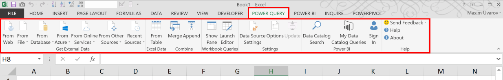  

### Что такое Power Query и как его найти в Excel 2016  

В Excel 2016 Power Query уже встроена. Найти ее можно на вкладке Data (Данные), блок "Get and Transform".


### Что такое Power Query и как его найти в Excel 365   ####

В Excel 365 Power Query уже встроена. Найти ее можно на вкладке Data (Данные), блок "Get and Transform".


*В зависимости от версии подписки Excel функционал Power Query может различаться.*


### Зачем нужен Power Query?

Power Query нужен для удобного преобразования данных (ETL-процесса).

Согласно википедии - [ETL](https://ru.wikipedia.org/wiki/ETL) (от англ. Extract, Transform, Load)  — процесс в управлении хранилищами данных, который включает в себя:

- извлечение данных из внешних источников;
- их трансформация и очистка, чтобы они соответствовали потребностям бизнес-модели;
- и загрузка их в хранилище данных.

Power Query отлично подходит для задач:

- подключения к разнообразным источникам (различным типам файлов, api, базам данных и т.п.);
- для удобного и гибкого преобразования данных в необходимый формат;
- Для создания повторяемых последовательностей обработки данных.


### Что такое запрос (Query)

Запрос (Query) это программа на языке M, которая представляет собой  последовательность обработки данных. 

В своем теле запрос может обращаться к неограниченному количеству источников данных (включая другие запросы). В результате выполнения запроса на выходе получается: 
- таблица - table
- значение - value, 
- список - list, 
- запись - record и т.д.

Список из всех запросов в Excel можно увидеть в разных местах. 

В списке из запросов книги (Queries Pane) интерфейсе Excel 2016:


В интерфейсе самого Power Query:


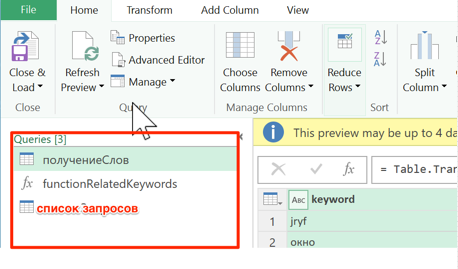


У каждого запроса есть свое имя. 

Имя запроса можно увидеть в нескольких местах. Там же его можно изменить: 

В интерфейсе Excel 2016. 


В интерфейсе Power Query. 


По имени запроса можно обращаться к результатам этого запроса из других запросов.


В случае, если имя запроса содержит пробелы (например, состоит из нескольких слов), то при обращении к этому запросу из других запросов он начинается с `#` и заключается в кавычки:

    #"имя запроса"

### Действия над запросами (по правому щелчку мыши на них)


### Duplicate (Дублировать) 


Команда Duplicate позволяет создать новый запрос и продублировать в нем все шаги исходного запроса (т.е. при дублировании появляется новый запрос с `#"Имя (2)"`, в котором содержатся все шаги из исходного запроса). Новый запрос, созданный при использовании команды Duplicate, никак не связан с оригинальным запросом. 

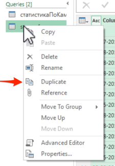

### Reference (Сослаться)


Создать новый запрос, в первом шаге которого обратиться по имени к оригинальному запросу.


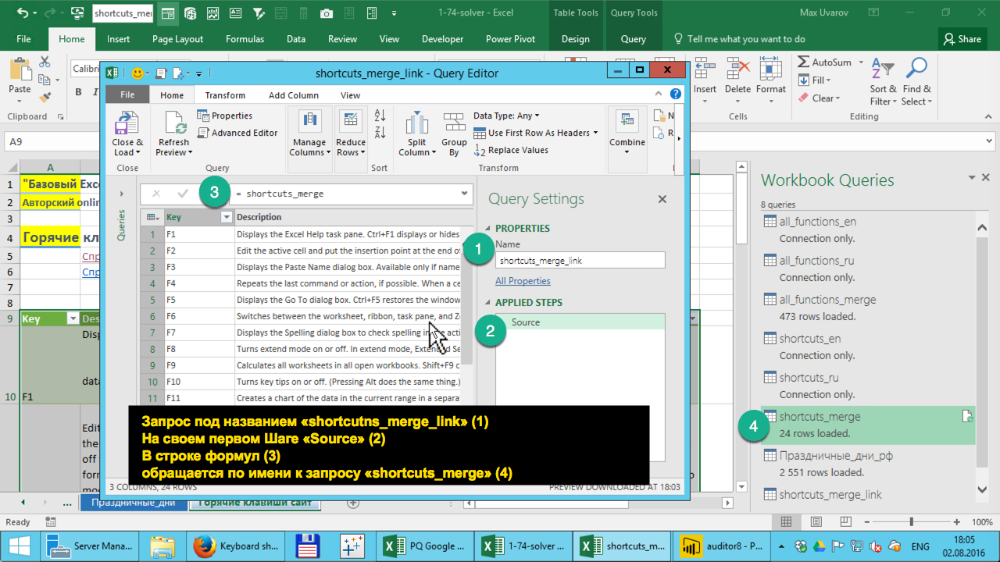


### Шаг (Step)

Отдельный этап обработки данных в рамках конкретного Запроса. 

Запрос состоит из шагов и включает как минимум один шаг. 

На каждое примененное действие в интерфейсе создается новый шаг. 

Список шагов конкретного запроса можно посмотреть в правой части экрана в панели настроек Запроса.

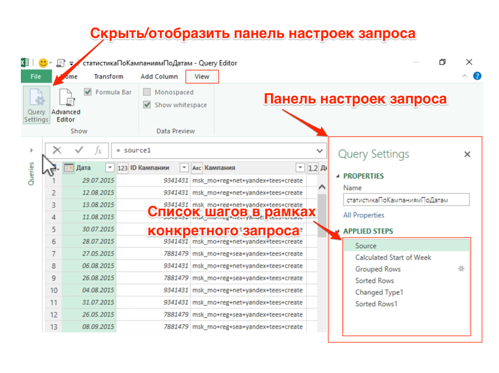


Каждый шаг это отдельная переменная, расположенная на отдельной строчке кода в скрипте запроса на языке программирования M.

Чтобы посмотреть формулу конкретного шага необходимо включить отображение строки формул на вкладке view и выбрать интересующий шаг в панели "Applied Steps".


Очередность шагов можно менять через интерфейс, используя контекстное меню.


А также перетаскивая шаги в списке.


### Загрузка данных из различных источников в Power Query  

Для того, чтобы начать работать с Power Query необходимо получить данные из какого-либо источника. Сделать это можно из интерфейса Power Query в Power BI.


В Excel 2010-2013 сделать это можно нажав на кнопки с указанием различных источников на панели Ribbon. 


А также из интерфейса Power Query  в Excel.

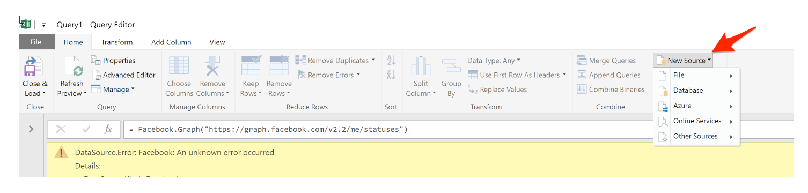

### Назначение типов данных для столбцов в Power Query  


Присвоенные отдельным столбцам типы данных определяют операции, которые применимы к ним.
Если выбрать столбец, то примененные к нему типы данных можно увидеть в следующих местах:

- В Power BI типы данных обозначаются иконками в столбцах:

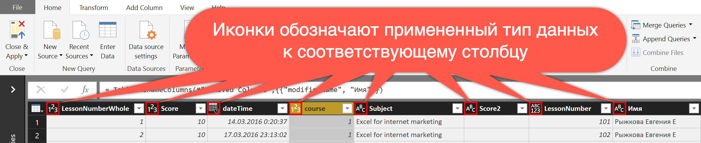

- В Power BI и Excel на вкладке «Home»

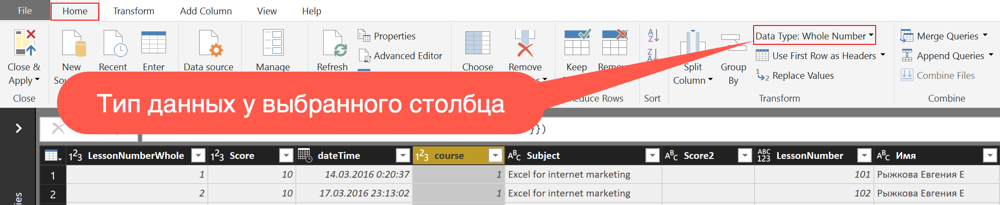

- В Power BI и Excel на вкладке «Transform»


### Какие типы данных существуют в Power Query?

На момент написания данного пособия в Power Query были следующие типы данных:
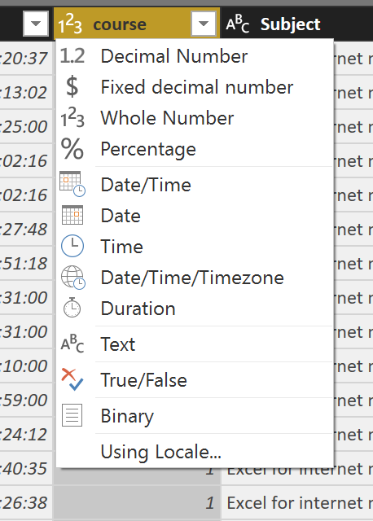


- Decimal number - десятичное число
- Fixed Decimal number - десятичное округленное до 4 знака
- Whole number - целое число
- Date / Time - дата / время
- Date - дата
- Time - время
- Date / Time / Timezone - дата / время / часовая зона
- Duration - длительность
- Text - текст
- True/False - истина / ложь
- Binary - двоичный код (например, изображение в формате bmp)

К тому же, в отдельных ячейках в Power Query могут быть структурированные типы данных:  

- Table - таблица
- List - список 
`{1,2,4} - список из элементов Чисел со значениями 1, 2, 4`

- Record - запись  
```[field1 = "текст в кавычках", field2 = "текст в кавычках2"]
```


### Автоматическое определение типов данных

В Power Query есть возможность автоматически определять типы данных. Она будет пытаться сделать это по тысяче первых строчек конкретного столбца. 

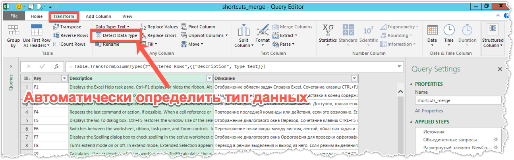


**Создание дубликата столбца**


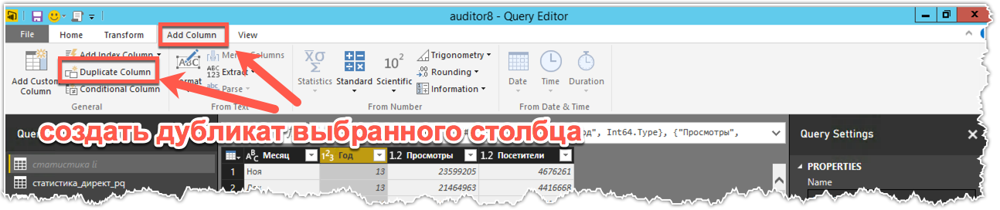


Контекстное меню:


### Переименование столбцов


Чтобы переименовать столбец нужно дважды щелкнуть на его названии:


### Remove Other Columns - удаление прочих столбцов


Для повышения личной эффективности (за счет лучшего фокуса на конкретных цифрах), сохранения оперативной памяти и поддержки быстродействия моделей нужно стараться оставлять в модели только необходимые данные (только необходимые столбцы и строчки).

Для этих целей отлично работает команда "remove other columns" (удалить прочие столбцы). 


### Split Column by Delimeter - Разделить текстовый столбец по разделителю

Команду разделить столбец по разделителю можно найти в нескольких местах:

Кнопка на Ribbon - Split Column


В контекстном меню, по щелчку на заголовок столбца.

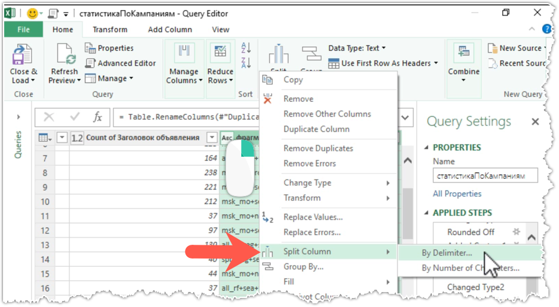


**Разделить столбец по произвольному разделителю**


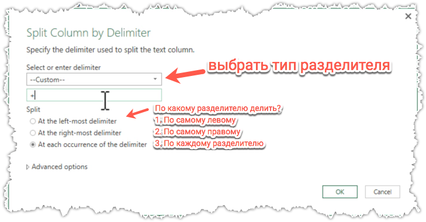

Указать максимальное количество столбцов


### Операции над таблицами в Power Query

### Append - добавление одной таблице к другой таблице 


Из интерфейса Power Query:


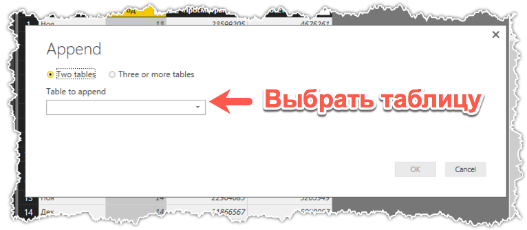

Из интерфейса Excel:


### Merge - соединение данных одного запроса с другим запросом по общему ключу (аналог ВПР)


Начало операции из интерфейса Power Query:


Начало операции merge из интерфейса Excel:

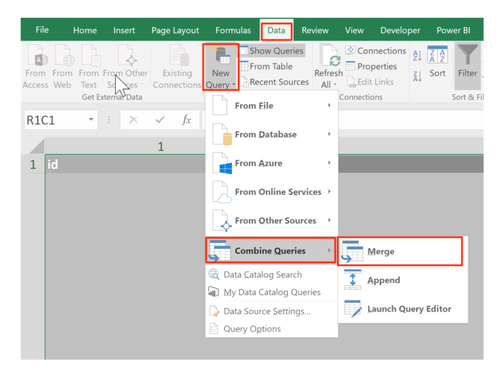

Выбор таблицы, из которой будем подтягивать данные, определение ключевых столбцов и типа операции

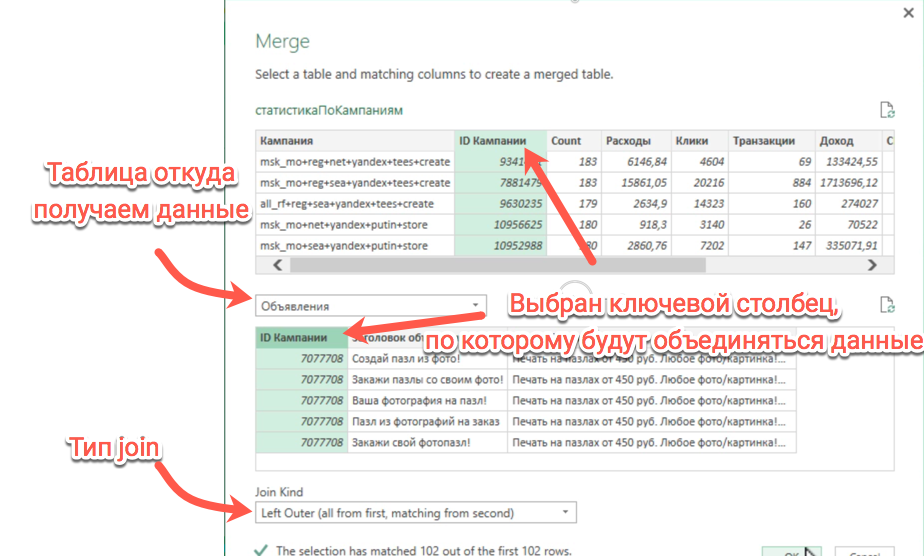


### Соединение данных по составному ключ в Power Query


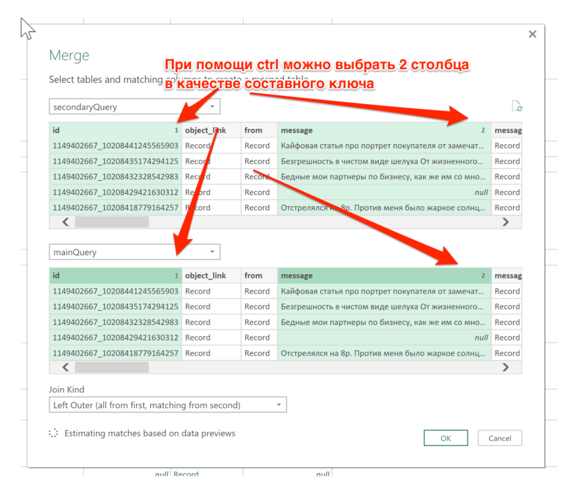


После нажатия на кнопку OK мы видим новый столбец с кнопкой

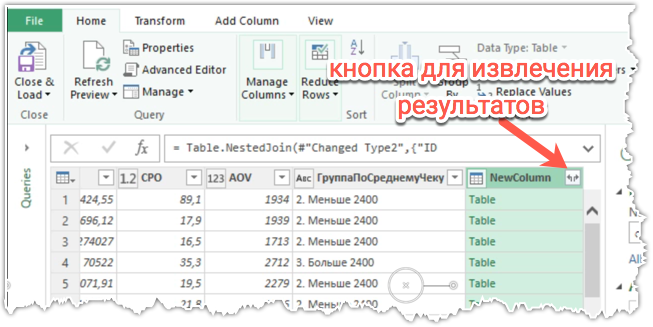


Нажимаем на кнопку, раскрываем столбец и выбираем желаемую операцию

Expand - развернуть данные из выбранных столбцов

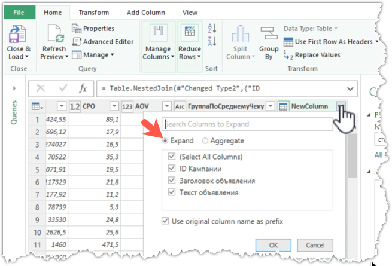


Aggregate - подсчитать данные в конкретных столбцах


Важно помнить что типы данных у ключевых столбцов (в обеих таблицах) должны быть одинаковыми.

### Извлечение данных из файлов лежащих в папке


Выбираем в качестве типа источника папку.
Далее выбираем конкретную папку с файликами, которые предполагается объединить. 
Файлики должны быть одного типа и с одинаковыми столбцами. 

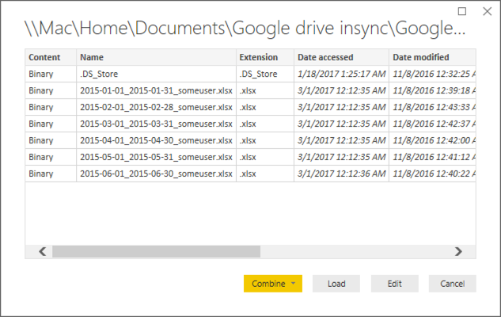


В появившемся окошке предпросмотра данных жмем на кнопочку edit. 


### Команда Group by (сгруппировать по полю)


Команду можно вызвать по клику на кнопку на панели Ribbon


Также команду можно вызвать из контекстного меню (если нажать правой кнопкой на заголовке столбца)


Интерфейс команды Group By с комментариями представлен на скриншоте ниже:

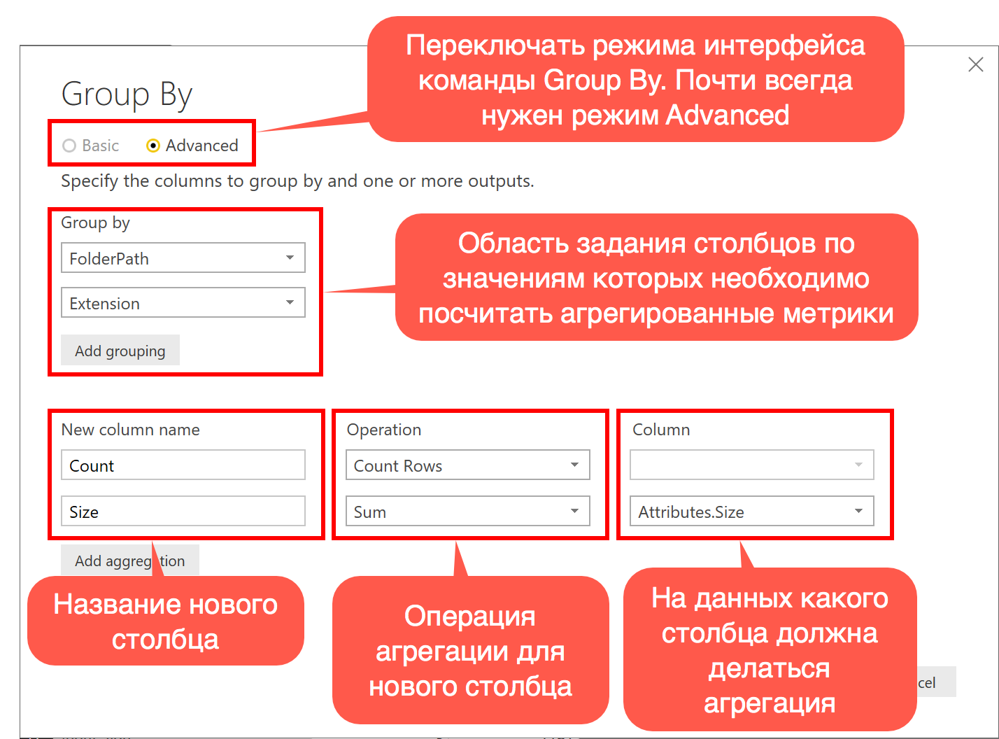


### Добавление нового столбца в Power Query


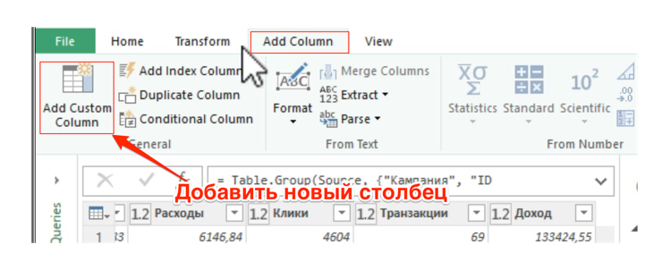

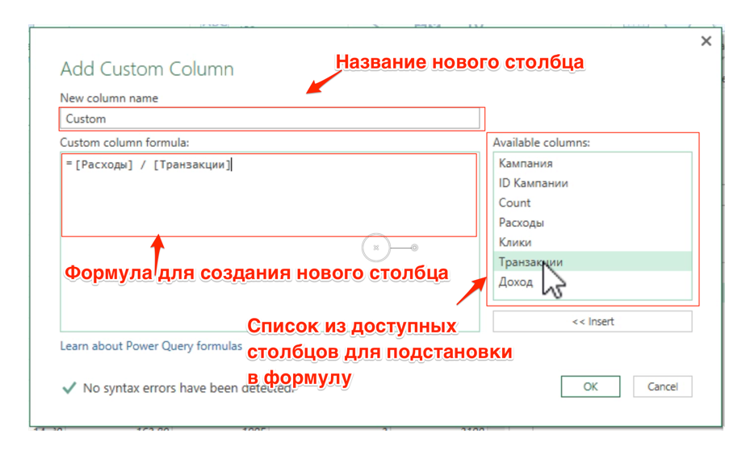


**if then else условия**


Для выбора действия в зависимости от условия в Power Query используется структура с оператором if then else

Пример:

if [столбец1] 0 then [столбец2] else [столбец3]


### Условный столбец (Conditional column)

Мастер добавления столбца с условным значением (условного столбца), формирует значение столбца согласно заданным правилам. Мастер добавления условного столбца можно найти в Power Query, на вкладке добавления столбца, как показано на скриншоте ниже. 


Пояснения к мастеру конфигурации условного столбца показаны на скриншоте ниже.

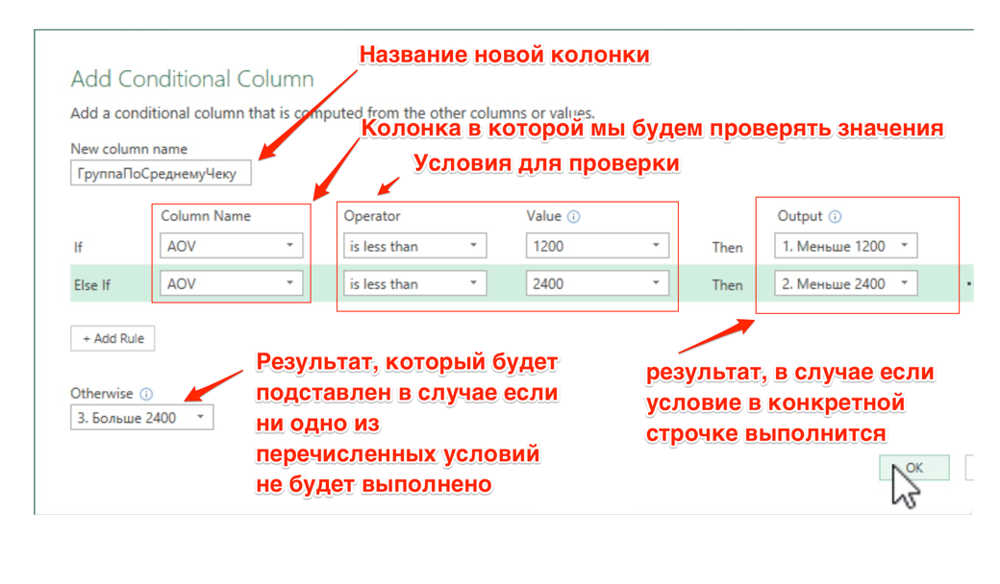

Для сведения - задаваемые условия в интерфейсе мастера пишут команду скрипта содержащего операторы `if then else`. Это значит, что первым будет проверено первое условие в мастере условного столбца. Все множество значений будет проверено по этому условию. В случае, если будут найдены результаты удовлетворяющие первому условию, то для них будет присвоено значение по результатам выполнения первого условия. Для остальных значений из множества, будет проверено следующее условие. И так далее, до тех пор, пока не будут проверенны все условия. Если для элементов множества не будет выполненно ни одно условие, то в условный столбец попадет значение из поля "В противном случае / (otherwise)". 

При создании условий важно помнить, операции сравнения включающие type null и другие типы данных, возвращают ошибку в качестве результата. Подробнее об этом можно прочитать [в блоге у Максима Зеленского](http://excel-inside.pro/ru/blog/2018/05/17/%D1%81%D1%80%D0%B0%D0%B2%D0%BD%D0%B5%D0%BD%D0%B8%D0%B5-%D0%B7%D0%BD%D0%B0%D1%87%D0%B5%D0%BD%D0%B8%D0%B9-null-%D0%B2-power-query/)


### Изменение типа столбца с текстового на десятичный, в случае если в качестве разделителя десятичной части используется точка вместо запятой


1. Необходимо щелкнуть правой кнопкой на заголовке столбца
2. Выбрать пункт «Change type»
3. И далее выбрать пункт «Using locale»
     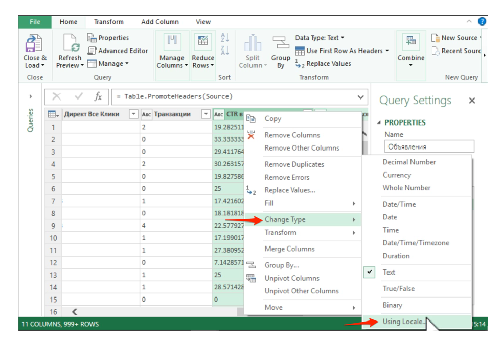

4. Выбираем страну, где в качестве разделителя используется точка (например, USA)


### Удалить дубликаты в столбцах


Команда "Remove Duplicates" проходит по выбранным столбцам (если выбрана вся таблица, то по всей таблице) и смотрит в них повторяющиеся ячейки (строчки, в случае если выбрана таблица). Если дубликаты найдены функция оставляет первую попавшуюся уникальную строчку и удаляет все последующие повторяющиеся
Найти команду можно на Ribbon - Home - Remove Duplicates (Удалить дубликаты в выбранных столбцах)

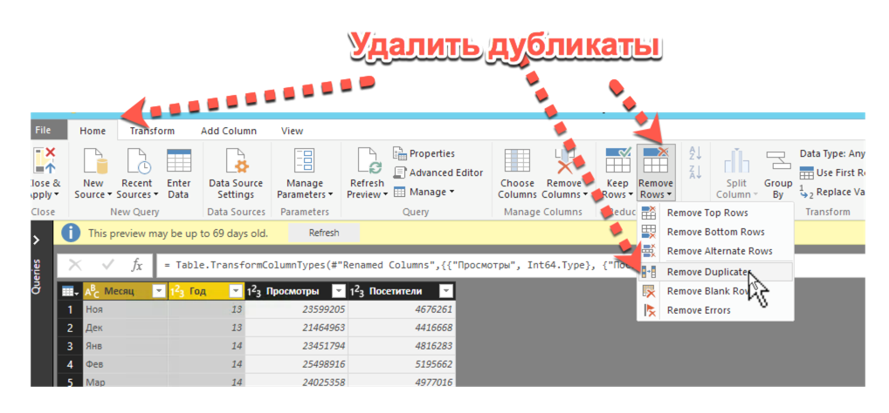

Либо найти команду можно щелкнув правой кнопкой на заголовке одного или нескольких выбранных столбцов. В случае, если выбраны несколько столбцов, то тогда будут удалены все неуникальные сочетания значений в каждой отдельной строчке в выбранных столбцах.


Удалить дубликаты строк в таблице можно нажав на кнопку в левом верхнем углу таблицы предпросмотра.


Аналогичного результата можно добиться если использовать команду "Group By"

**Count rows - Подсчитать количество строчек в текущей таблице**


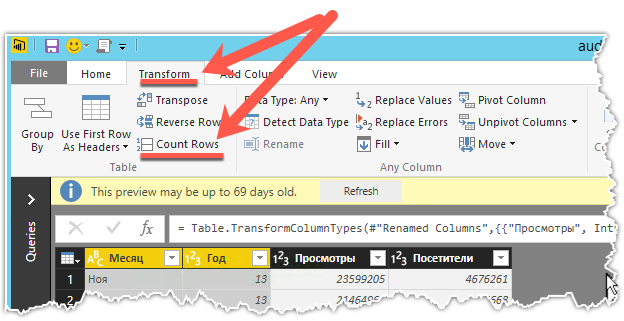


### Извлечение шагов в отдельный запрос


Для выполнения необходимо щелкнуть правой кнопкой на конкретном шаге обработки. 
Выбрать пункт меню «Extract previous steps»


ввести имя нового запроса, который будет создан на основе предыдущих шагов

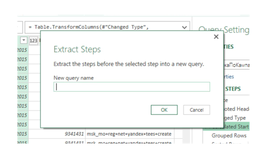

### Права доступа, Formula.Firewall


Текст взят из [Power bi formula firewall privacy settings - marketing-wiki.ru](http://marketing-wiki.ru/wiki/Power_bi_formula_firewall_privacy_settings)

При работе в Power BI, при обращении к внешним источникам данных вроде различных API могут возникать ошибки вроде:
OLE DB or ODBC error: [information is needed in order to combine data] 

или
Formula.Firewall: Query is accessing data sources that have privacy levels which cannot be used together. Please rebuild this data combination 

Это ошибки, которые возникают из-за встроенного в Power BI Fomrula.Firewall - механизма, который следит, чтобы данные из Power BI передавались только согласно выставленным правилам доступа.

то есть Power Bi пытается защитить нас, чтобы мы случайно не отправили какие-либо данные (вроде токена) на сервер-злоумышленника.

Однако, если мы работаем с API, то нам неминуемо нужно отправлять данные в интернет. Соответственно, чтобы не иметь проблем в этом процессе проще всего в настройках Power BI выключить Formula.Firewall. Это делается в разделе Privacy. Нужно выбрать 3-й пункт - "ignore privacy level settings"


## Power Pivot 

### Что такое Power Pivot в Excel?

Power Pivot - это надстройка над Excel, представляющая из себя быструю колоночную базу данных VertiPaq с языком запросов DAX (часто вместо VertiPaq говорят Power Pivot).  В отличие от Excel число строк загруженных в Power Pivot ограничено лишь размером доступной оперативной памяти компьютера. Быстродействие Power Pivot во много раз превосходит быстродействие формул в Excel. Также Power Pivot по производительности превосходит и Power Query (при этом часто он потребляет меньше ресурсов). 
Результаты выполнения запросов доступны пользователям в сводных таблицах и сводных диаграмма MS Excel. Таким образом сводные таблицы выступают аналитическим интерфейсом к данным хранящимся в Power Pivot. 


### Что такое Power Pivot в Power BI?

В Power BI Power Pivot встроен как база данных, к которой присоединяются различные визуализации. 


### Что такое DAX?

Dax (Data Analysis Expressions) - это язык программирования использующийся для запросов в базе данных VertiPaq. 


### Модель данных

Модель данных - совокупность таблиц, связей между ними и вычисляемых мер в базе данных VertiPaq. Благодаря своей быстроте модель данных позволяет создавать мгновенно пересчитывающиеся меры, которые, в свою очередь, позволяют создавать интерактивные визуализации. 


### Таблицы

Таблицы - совокупность строк, разделённых на столбцы. 

У каждого столбца задан тип данных (который, как правило, наследуется из типов данных заданных для столбцов в Power Query). 

У столбцов с числовыми типами данных можно увидеть значок сигмы Слева от них. И такие столбцы по умолчанию будут просуммированы, в случае если добавить их в область значений любой визуализации. 


Если же добавить в область значений столбцы с не числовыми типами данных (без значка сигмы), то к ним будет применена операция по умолчанию: count (подсчет количества значений). 

Список из таблиц загруженных в модель данных можно найти в дереве fields в правой части окна Power BI.

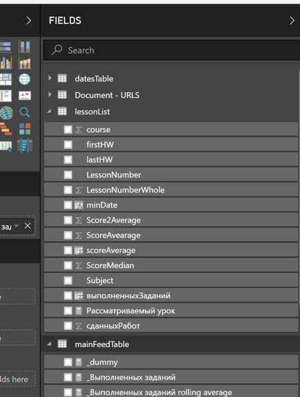

Каждая таблица имеет название, по которому к данным конкретной таблицы можно обращаться в мерах и вычисляемых столбцах.
В случае если в названии таблицы присутствует пробел или не латинские символы, то при обращении к таблице извне её название заключается в одинарные кавычки автоматически:

`'название с пробелом'`

Однако, если мы заключим в кавычки название таблицы без пробелов, то все будет работать как предполагалось:

`'название'`


### Функции Dax

Функции языка Dax похожи на функции Excel, с той лишь разницей, что в качестве аргументов используют столбцы, целые таблицы или скалярные выражения (простые значения), а не ячейки.

В качестве разделителей аргументов в зависимости от локали используются:
- ";" (и "," для десятичных)
- "," (и "." для десятичных)


### Меры (Measures)

Вычисляются только в момент использования.
Рассчитываются в рамках текущего контекста фильтров. Именно это свойство позволяет строить интерактивные визуализации, которые фильтруются при нажатии на определенные области конкретных визуализаций. 
Меры хоть и принадлежат конкретной таблице, но могут безболезненно быть перенесены в любую другую в рамках документа. Поэтому хорошая практика при использовании мер формулах не включать название таблицы, в которой мера лежит. То есть вместо 'таблица'[мера] писать просто [мера].

### Быстрые меры (Quick Measures) ####

Функционал быстрых мер позволяет создавать сложные DAX формулы без написания кода. Вместо написания кода нужно сконфигурировать желаемую меру в графическом интерфейсе. Подробнее о быстрых мерах можно прочитать в справке по [Power BI](https://docs.microsoft.com/ru-ru/power-bi/desktop-quick-measures)


### Вычисляемые Столбцы (Calculated Columns)

Рассчитываются однажды во время обновления таблицы в модели данных.
Вычисляемые столбцы занимают место в памяти. 
Вычисляемые столбцы рассчитываются в рамках контекста строки. 
В отличие от мер, вычисляемые столбцы могут использоваться для фильтрации и сортировки таблиц.
Принадлежат конкретной таблице и их лучше указывать в формулах вместе с названием таблицы, даже если Power Pivot позволяет этого не делать.

Подробнее про столбцы и меры читать здесь:  

- [Calculated Columns and Measures in DAX - SQLBI](http://www.sqlbi.com/articles/calculated-columns-and-measures-in-dax/)


### Контекст выполнения функции (Evaluation context)

В Power Pivot существуют два контекста выполнения формулы, которые действуют одновременно:

- Контекст фильтров (Filter context) 
- Контекст строк (Row context)

Это массивная и сложная тема. На момент написания методички автор так и не разобрался с темой до того уровня, чтобы рассказывать об этом окружающим. Потому рекомендую обратиться к достоверным источникам вроде:  

- Марко Руссо и Альберто Феррари [https://www.sqlbi.com/](https://www.sqlbi.com/).
- Справка Microsoft Power BI: [Основные сведения о DAX в Power BI Desktop](https://docs.microsoft.com/ru-ru/power-bi/desktop-quickstart-learn-dax-basics#context)


### Связь таблиц в модели данных 

Для связи таблиц в модели данных в одной из таблиц в ключевом поле должны быть уникальные значения. 
Также столбцы должны быть одного типа данных.

Направление связи имеет значение. 
Вычисляемые столбцы могут использоваться для создания связей между таблицами.

Справка:
[Создание связей и управление ими в Power BI Desktop - Power BI | Microsoft Docs](https://docs.microsoft.com/ru-ru/power-bi/desktop-create-and-manage-relationships)


### Связь таблиц по ключевому столбцу дата и time-intelligence функции ####

В случае, если в модели данных есть отдельная таблица-календарь (вроде [такой](https://gist.github.com/maxim-uvarov/d58cd21da4e486abc1408e4ae58f302d)), и если таблица с фактами связана с таблицей-календарем по полю дата, то для создания [быстрых мер](#Быстрые-меры-quick-measures) в поле дата нужно использовать столбец с датами из таблицы календаря. Столбец с датами из таблицы с фактами в быстрых мерах работать не будет. 


### Часто используемые функции DAX

`SUM (Столбец)` - Cумма чисел по столбцу

`COUNTA (Столбец)` - Количество значений в столбце

`DISTINCTCOUNT (Столбец)` - Количество уникальных значений в столбце

`SUMX (Таблица, Выражение)` - Сумма значений выражения, которое выполняется для каждой строчки таблицы

`DIVIDE (Значение числителя, значение знаменателя, альтернативный вариант в случае ошибки деления числителя на знаменатель)` - Безопасное деление

`IFERROR (Значение, Значение если ошибка)` - Если ошибка

`IF (Логическое выражение, значение если правда, значение если ложь )` - Если

### Метрики контекстной рекламы в DAX

CTR (Кликабельность) 

    = SUM ( Показы ) / SUM ( Клики )

CPC (Цена клика) 

    = SUM ( Расход ) / SUM ( Клики )

Ставка (Максимальная цена клика установленная рекламодателем)

Ставка Средняя

    = AVERAGE ( ставка )

Ставка СреднеВзвешенная на клики

    = SUMX ( ставка * клики ) / SUM ( клики )

Ставка СреднеВзвешенная на показы

    = SUMX ( ставка * показы ) / SUM (показы)

CR (Коэффициент конверсии фактический)

    = SUM ( транзакции ) / SUM ( сессии )

Ключевая фраза: количество

    = COUNTA ( ключевая фраза )

Ключевая фраза: количество уникальных

    = DISTINCTCOUNT ( ключевая фраза )


### Про абсолютные и относительные метрики в выгрузках

Средний показатель отказов рассчитывается по формуле:

    = SUM ( отказы ) / SUM ( визиты ) 


Если в выгрузке нет абсолютного числа ОТКАЗОВ, но есть ПОКАЗАТЕЛЬ ОТКАЗОВ, то для каждой строчки с исходными данными предварительно необходимо рассчитать абсолютное число ОТКАЗОВ. Для этого нужно умножить ПОКАЗАТЕЛЬ ОТКАЗОВ на ЧИСЛО ВИЗИТОВ. После этого у вас появится возможность рассчитывать средний показатель отказов корректно. 

Аналогичным образом следует поступить с глубиной просмотра и временем на сайте. 

Распространенная ошибка рассчитывать СРЕДНИЙ ПОКАЗАТЕЛЬ ОТКАЗОВ в качестве встроенной меры AVERAGE по столбцу ПОКАЗАТЕЛЬ ОТКАЗОВ (см скрин. http://bit.ly/2JMKSl1). 


Так средний показатель отказов рассчитывать некорректно. 

### Формат отображения чисел в мерах и столбцах ####

Формат отображения значений мер задается при выбранной мере, на вкладке "Modeling", в блоке "Formating"


### Полезные ресурсы по DAX

- [sqlbi.com/articles/calculated-columns-and-measures-in-dax/](http://www.sqlbi.com/articles/calculated-columns-and-measures-in-dax/)
- [powerpivotpro.com/2013/02/when-to-use-measures-vs-calc-columns/](http://www.powerpivotpro.com/2013/02/when-to-use-measures-vs-calc-columns/)
- [Клевый курс на udemy про Power Pivot](https://www.udemy.com/power-pivot-workshop-beginner/learn/v4/overview)
- [Книга: The Definitive Guide to DAX: Business intelligence with Microsoft Excel, SQL Server Analysis Services, and Power BI (Business Skills) 1st Edition](https://www.amazon.com/Definitive-Guide-DAX-intelligence-Microsoft/dp/073569835X/ref=asap_bc?ie=UTF8)
- [Daxpatterns.com](http://www.daxpatterns.com/)
- [Канал Curbal на youtube с подробными обучающими видео DAX Fridays](https://www.youtube.com/channel/UCJ7UhloHSA4wAqPzyi6TOkw)


## Визуализации в Power BI ##

### Срезы в Power BI - Слайсеры (Slicers) ####

- [Справка](https://docs.microsoft.com/ru-ru/power-bi/power-bi-visualization-slicers)

#### Срезы с относительными датами (Relative slicers) #####

- https://docs.microsoft.com/ru-ru/power-bi/desktop-slicer-filter-date-range

## Настройки Power BI ##

### Фоновые данные - разрешить скачивание в фоне (Background data - allow data preview)

Загрузку данных в фоне часто рекомендуют отключить, во избежание проблем с производительностью. Ссылки по теме:  

1. Параметр Allow Data Preview To Download In The Background в Power Query и Power BI - статья Криса Вебба: [перевод 🇷🇺](https://needfordata.ru/blog/%D0%BF%D0%B0%D1%80%D0%B0%D0%BC%D0%B5%D1%82%D1%80-allow-data-preview-to-download-in-the-background-%D0%B2-power-query-%D0%B8-power-bi), [оригинал 🇺🇲](https://blog.crossjoin.co.uk/2016/12/05/power-query-power-bi-and-the-allow-data-preview-to-download-in-the-background-option/).
2. Ветка, в предложения выключить эту настройку по умолчанию [uservoice](https://excel.uservoice.com/forums/304921-excel-for-windows-desktop-application/suggestions/20636248-change-default-settings-for-data-preview-in-backgr).


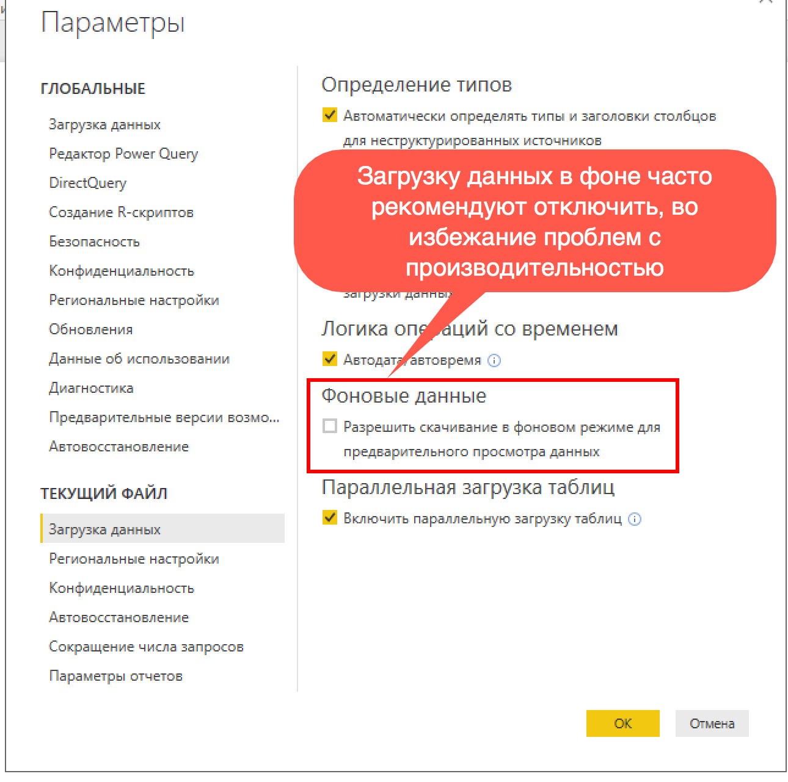

## Приложения

### Сочетания клавиш окна редактирования DAX формул

#### Базовое редактирование

|   Клавиша       |                  | Описание |
|-----------------|------------------|----------|
| `Ctrl+X`        |                  | Вырезать строку (Пустое выделение) |
| `Ctrl+C`        |                  | Скопировать строку (Пустое выделение) |
| `Alt+↑`         | `Alt+↓`          | Перемещает текущую строку вверх / вниз |
| `Shift+Alt+↑`   | `Shift+Alt+↓`    | Копирует строку и вставляет её выше / ниже |
| `Ctrl+Shift+K`  |                  | Удаляет строку |
| `Shift+Enter`   |                  | Добавить новую строку ниже под курсором |
| `Ctrl+]`        | `Ctrl+[`         | Увеличить / уменьшить отступ строки |
| `Tab`           | `Shift+Tab`      | Увеличить / уменьшить отступ строки |
| `Home`          | `End`            | Перейти в начало / конец строки |
| `Ctrl+Home`     | `Ctrl+End`       | Перейти в начало / конец DAX формулы |
| `Ctrl+K Ctrl+C` | `Ctrl+K Ctrl+U`  | Поставить / убрать однострочный комментарий |
| `Ctrl+/`        |                  | Поставить или убрать однострочный комментарий |
| `Shift+Alt+A`   |                  | Поставить или убрать однострочный комментарий |

#### Навигация

|   Клавиша       |                  | Описание |
|-----------------|------------------|----------|
| `Ctrl+G`        |                  | Перейти к строке |
| `F8`            | `Shift+F8`       | Перейти к ближайшей / следующей ошибке или предупреждению |

### Поиск и замена

|   Клавиша       |                  | Описание |
|-----------------|------------------|----------|
| `Ctrl+D`        |                  | Выделить слово под курсором целиком, при повторном нажатии выделяет аналогичные слова по тексту |
| `Ctrl+K Ctrl+D` |                  | Перейти к следующему совпадающему выделению |

#### Мультикурсор и выделение

|   Клавиша       |                  | Описание |
|-----------------|------------------|----------|
| `Ctrl+A`        |                  | Выделить все |
| `Alt+Клик`      |                  | Добавить курсор к выделению |
| `Ctrl+Alt+↑`    | `Ctrl+Alt+↓`     | Добавить мультикурсор выше / ниже |
| `Ctrl+U`        |                  | Убрать последнее выделение курсора |
| `Ctrl+F2`       |                  | Выделяет все вхождения слова |
| `Ctrl+Shift+L`  |                  | Выделяет все вхождения выделенного текста |
| `Shift+Alt+→`   | `Shift+Alt+←`    | Расширить / уменьшить текущее выделение по строке |

## Вместо заключения ##

Данное методическое пособие было выложен в открытый доступ 21.05.2018. С тех пор каждый желающий способен внести в него правки или дополнить его собственной актуальной информацией. 

Сделать это можно по адресу: https://github.com/power-bi/PowerBI-book-ru

Upd: по состоянию на 30-09-2018 в методическом пособии появилась статья от @DmitriyVlasov про [шпаргалку с горячими клавишами](##Сочетания-клавиш-окна-редактирования-dax-формул)

[](https://github.com/power-bi/PowerBI-book-ru)
