# Power Query, он же редактор запросов (Query Editor)

## Power Query в Power BI

В программе Power BI Desktop Power Query встроенный модуль. В справке и интерфейсе этот модуль называется Query Editor или редактор запросов. Power Query это основной инструмент данных в Power BI desktop. Как показано на скриншоте ниже все четыре выделенные кнопки относятся к редактору запросов Power Query.

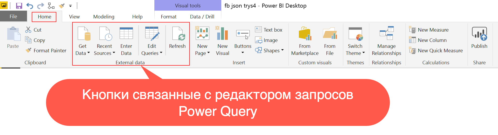

## Power Query в Excel 2010, 2013

Также, Power Query это надстройка над MS Excel 2010 - 2013. Она устанавливается дополнительно. Скачать надстройку можно по [ссылке](https://www.microsoft.com/en-us/download/details.aspx?id=39379). На панели Ribbon в Excel 2010 и 2013 Power Query посвящена отдельная вкладка.


## Power Query в Excel 2016, 2019, 365

В Excel 2016 и последующих версиях Power Query встроена. Найти ее можно на вкладке Data (Данные), блок "Get and Transform". Скриншоты, как Power Query выглядит в различных версиях офиса приведены ниже:

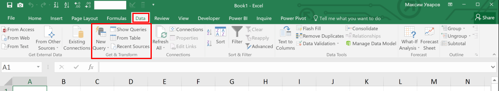


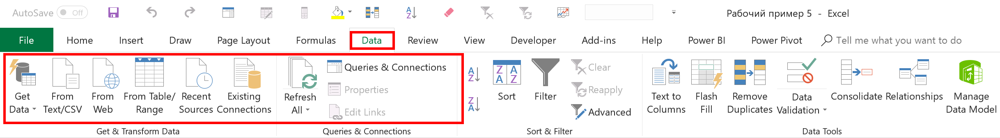

_В зависимости от версии подписки Excel функционал Power Query может различаться._

## Зачем нужен Power Query

Power Query нужен для удобного преобразования данных (ETL-процесса).

Согласно википедии - [ETL](https://ru.wikipedia.org/wiki/ETL) (от англ. Extract, Transform, Load) -- процесс в управлении хранилищами данных, который включает в себя:

- извлечение данных из внешних источников;
- их трансформация и очистка, чтобы они соответствовали потребностям бизнес-модели;
- и загрузка их в хранилище данных.

Power Query отлично подходит для задач:

- подключения к разнообразным источникам (различным типам файлов, api, базам данных и т.п.);
- для удобного и гибкого преобразования данных в необходимый формат;
- Для создания повторяемых последовательностей обработки данных.

## Что такое запрос (Query)

Запрос (Query) это программа на языке M, задающая последовательность обработки данных.

В своем теле запрос может обращаться к неограниченному количеству источников данных (включая другие запросы). Результат выполнения запроса может иметь любой из поддерживаемых структурированнных или примитивных типов данных, например:

- таблица - table
- значение - value,
- список - list,
- запись - record и т.д.

Список из всех запросов в Excel можно увидеть в разных местах.

В списке из запросов книги (Queries Pane) интерфейсе Excel 2016:

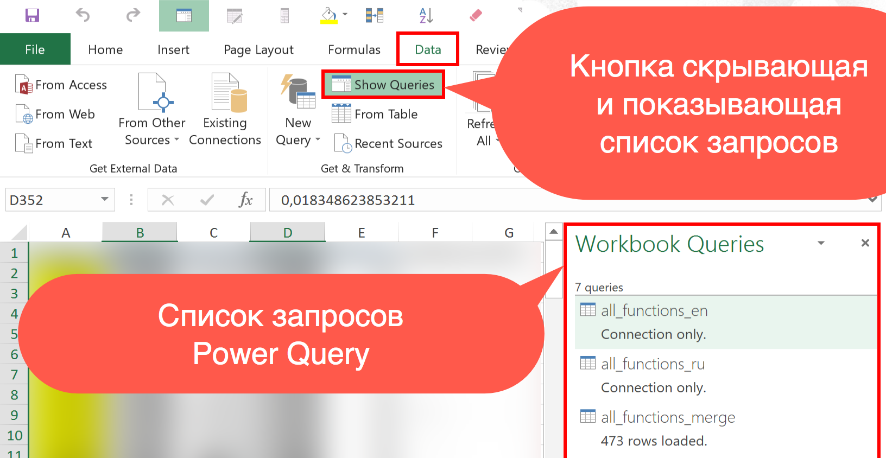

В интерфейсе самого Power Query:

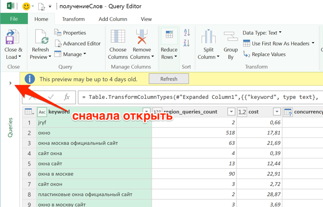


У каждого запроса есть свое имя.

Имя запроса можно увидеть в нескольких местах. Там же его можно изменить:

В интерфейсе Excel 2016.

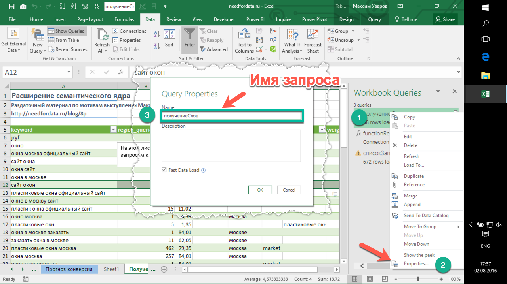

В интерфейсе Power Query.

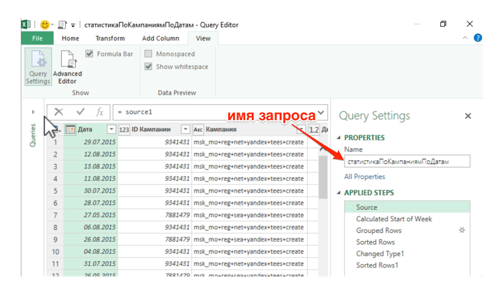

По имени запроса можно обращаться к результатам этого запроса из других запросов.


В случае, если имя запроса содержит пробелы (например, состоит из нескольких слов), то при обращении к этому запросу из других запросов он начинается с `#` и заключается в кавычки:

```
#"имя запроса"
```

## Действия над запросами (по правому щелчку мыши на них)

## Duplicate (Дублировать)

Команда Duplicate позволяет создать новый запрос и продублировать в нем все шаги исходного запроса (т.е. при дублировании появляется новый запрос с `#"Имя (2)"`, в котором содержатся все шаги из исходного запроса). Новый запрос, созданный при использовании команды Duplicate, никак не связан с оригинальным запросом.


## Reference (Сослаться)

Создать новый запрос, в первом шаге которого обратиться по имени к оригинальному запросу.

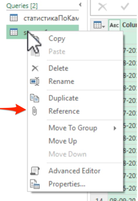


## Шаг (Step)

Отдельный этап обработки данных в рамках конкретного Запроса.

Запрос состоит из шагов и включает как минимум один шаг.

На каждое примененное действие в интерфейсе создается новый шаг.

Список шагов конкретного запроса можно посмотреть в правой части экрана в панели настроек Запроса.


Каждый шаг это отдельная переменная, расположенная на отдельной строчке кода в скрипте запроса на языке программирования M.

Чтобы посмотреть формулу конкретного шага необходимо включить отображение строки формул на вкладке view и выбрать интересующий шаг в панели "Applied Steps".

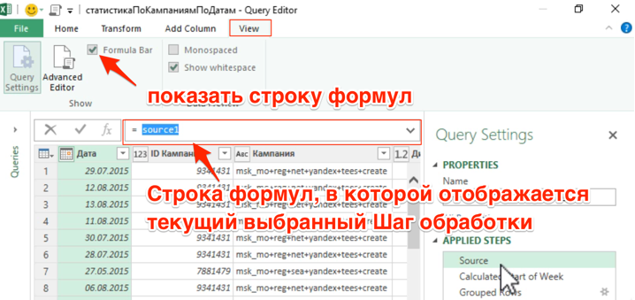

Очередность шагов можно менять через интерфейс, используя контекстное меню.

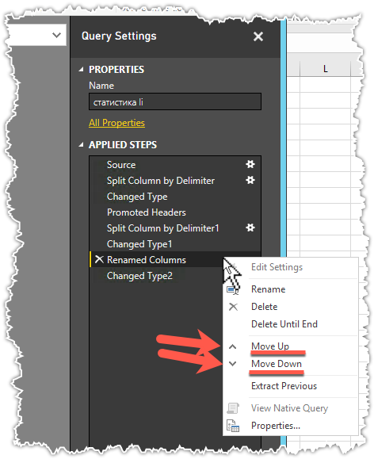

А также перетаскивая шаги в списке.

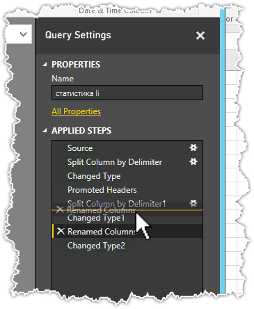

## Параметры в Power Query

- [🇺🇲Статья о параметрах Power Query](https://powerbi.microsoft.com/en-us/blog/deep-dive-into-query-parameters-and-power-bi-templates/)

## Получение данных в Power Query

Чтобы начать работать с Power Query, необходимо настроить получение данных из какого-либо источника. Сделать это можно из интерфейса Power Query в Power BI по нажатию на кнопку Get Data.

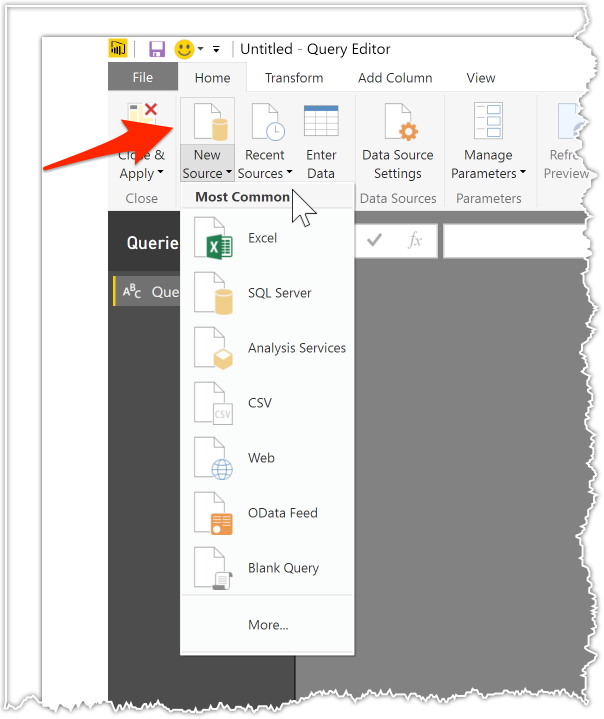

В Excel 2010-2013 сделать это можно нажав на кнопки с указанием различных источников на панели Ribbon.

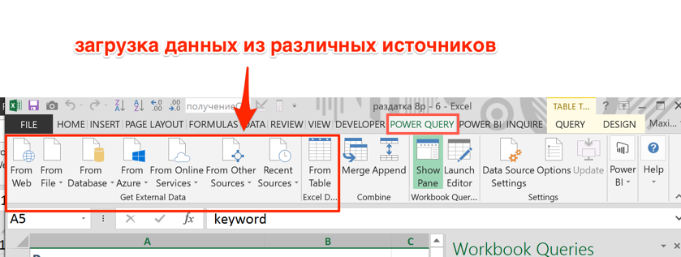

А также из интерфейса Power Query в Excel.


## Типы данных в Power Query ##

В Power Query существуют примитивные и структурированные типы данных. Примитивные типы данных содержат в себе лишь одно значение, в то время как структурированные типы данных могут содержать в себе как одно так и множество значений. В зависимости от заданного типа данных 

## Примитивные типы данных Power Query

 

- Decimal number - десятичное число
  `Number.Type` или `type number`
- Time - время
  `Time.Type` или `type time`
- Date - дата
  `Date.Type` или `type date`
- Date / Time - дата / время
  `DateTime.Type` или `type datetime`
- Date / Time / Timezone - дата / время / часовая зона
  `DateTimeZone.Type` или `type datetimezone`
- Duration - длительность
  `Duration.Type` или `type duration`
- Fixed Decimal number - десятичное округленное до 4 знака
  `Currency.Type`
- Whole number - целое число
  `Int64.Type` 
- Text - текст
  `Text.Type` или `type text`
- True/False - истина / ложь
- Binary - двоичный код (например, изображение в формате bmp)
- Percentage - проценты
  `Percentage.Type` 

## Структурированные типы данных в Power Query

- Table - таблица ```#table({"Заголовок1", "Заголовок2"}, 
    {
        {"Строка1Столбец1", "Строка1Столбец2"}, 
        {"Строка2Столбец1", "Строка2Столбец2"}
    }) ```
- List - список `{1,2,4} - список из элементов Чисел со значениями 1, 2, 4`
- Record - запись `[field1 = "текст в кавычках", field2 = "текст в кавычках2"]`

## Задание типов данных для столбцов в Power Query

Присвоенные отдельным столбцам типы данных определяют операции, которые применимы к ним. Если выбрать столбец, то примененные к нему типы данных можно увидеть в следующих местах:

- Типы данных столбцов таблицы обозначаются иконками в области заголовков:


- При выбранном столбце, его тип данных в Power BI и Excel на вкладке «Home»


- При выбранном столбце, его тип данных в Power BI и Excel на вкладке «Transform»

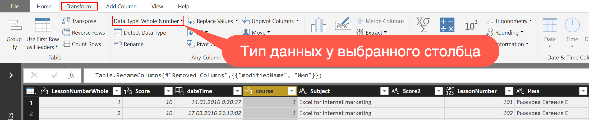


## Автоматическое определение типов данных для столбцов

В Power Query есть функция "автоматически определять типы данных". При помощи данной функции Power Query будет подбирать тип данных к столбцу на основ первой тысячи строчек конкретного столбца.


## Создание дубликата столбца

Команда на Ribbon:


Команда в контекстном меню:

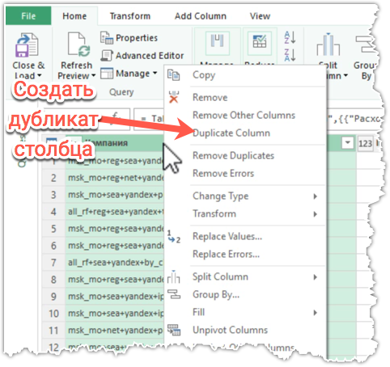

## Переименование столбцов

Чтобы переименовать столбец нужно дважды щелкнуть на его названии:

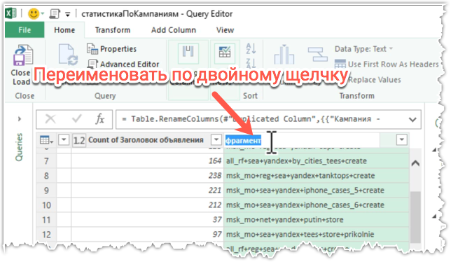

## Remove Other Columns - удаление прочих столбцов

Для повышения личной эффективности (за счет лучшего фокуса на конкретных цифрах), сохранения оперативной памяти и поддержки быстродействия моделей следует оставлять в модели данных только необходимые данные (только необходимые столбцы и строчки).

Для этих целей отлично работает команда "remove other columns" (удалить прочие столбцы).

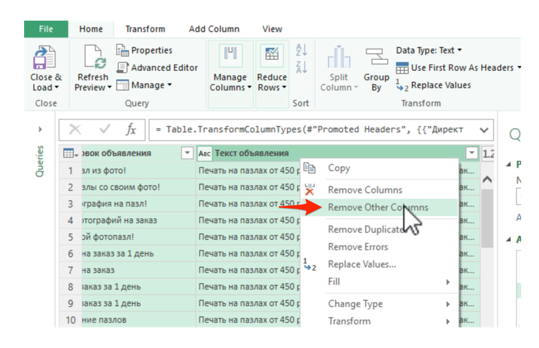

## Split Column by Delimeter - Разделить текстовый столбец по разделителю

Команду "разделить столбец по разделителю" можно найти в нескольких местах:

Кнопка на Ribbon - Split Column

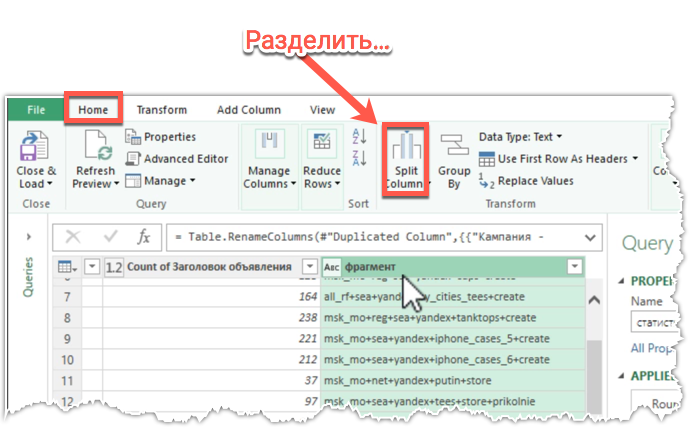

В контекстном меню, по щелчку на заголовок столбца.


Разделить столбец по произвольному разделителю


Указать максимальное количество столбцов

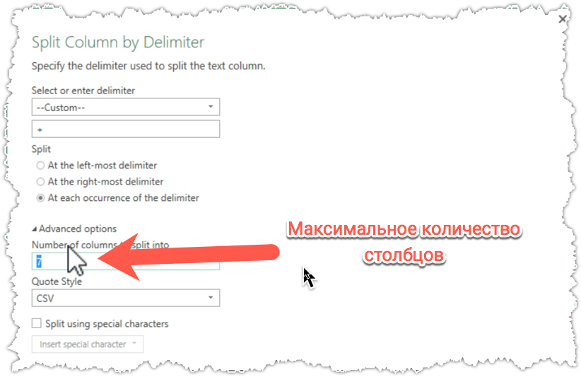


## Действия над таблицами и столбцами таблиц

## Append - добавление одной таблице к другой таблице

Из интерфейса Power Query:

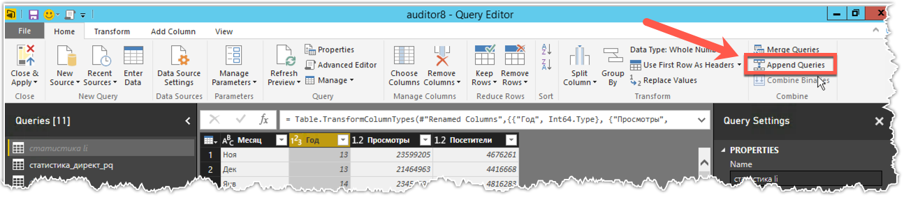


Из интерфейса Excel:

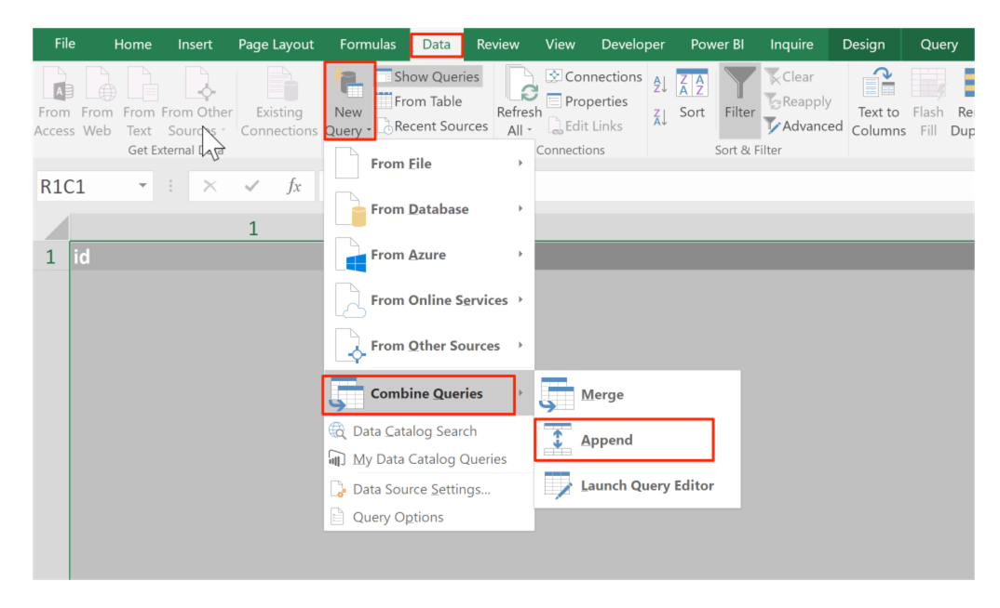

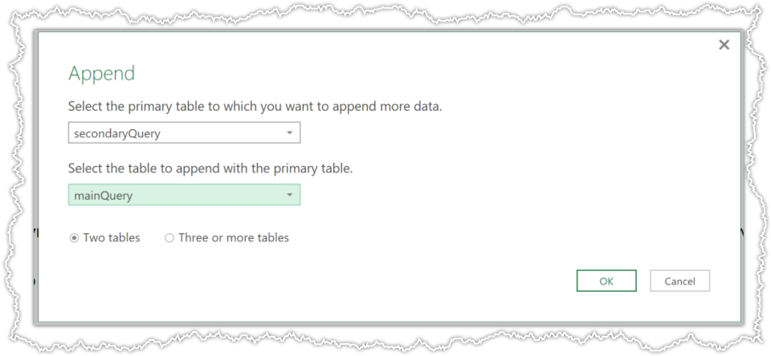

## Merge - соединение данных одного запроса с другим запросом по общему ключу (аналог ВПР)

Начало операции из интерфейса Power Query:

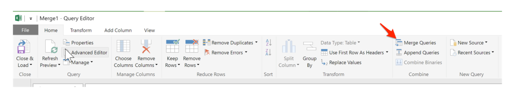

Начало операции merge из интерфейса Excel:


Выбор таблицы, из которой будем подтягивать данные, определение ключевых столбцов и типа операции


## Соединение данных по составному ключ в Power Query


После нажатия на кнопку OK мы видим новый столбец с кнопкой


Нажимаем на кнопку, раскрываем столбец и выбираем желаемую операцию

Expand - развернуть данные из выбранных столбцов


Aggregate - подсчитать данные в конкретных столбцах

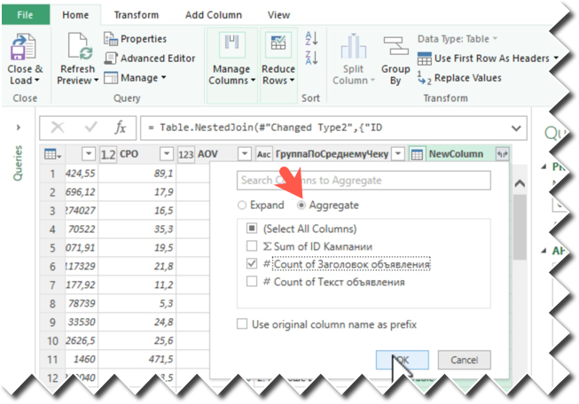

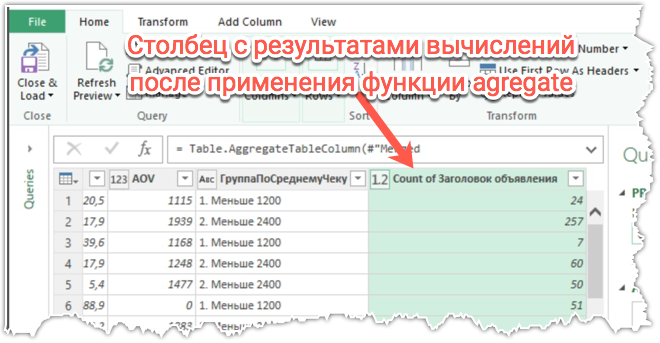

Важно помнить что типы данных у ключевых столбцов (в обеих таблицах) должны быть одинаковыми.


## Команда Group by (сгруппировать по полю)

Команду можно вызвать по клику на кнопку на панели Ribbon

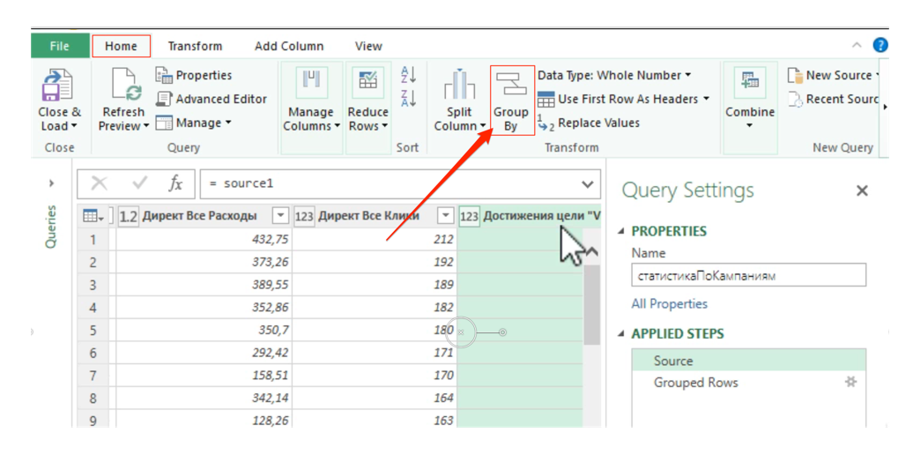

Также команду можно вызвать из контекстного меню (если нажать правой кнопкой на заголовке столбца)

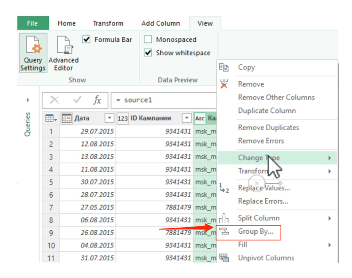

Интерфейс команды Group By с комментариями представлен на скриншоте ниже:


## Добавление нового столбца в Power Query


### if then else условия

Для выбора действия в зависимости от условия в Power Query используется структура с оператором if then else

Пример:

`if [столбец1] 0 then [столбец2] else [столбец3]`

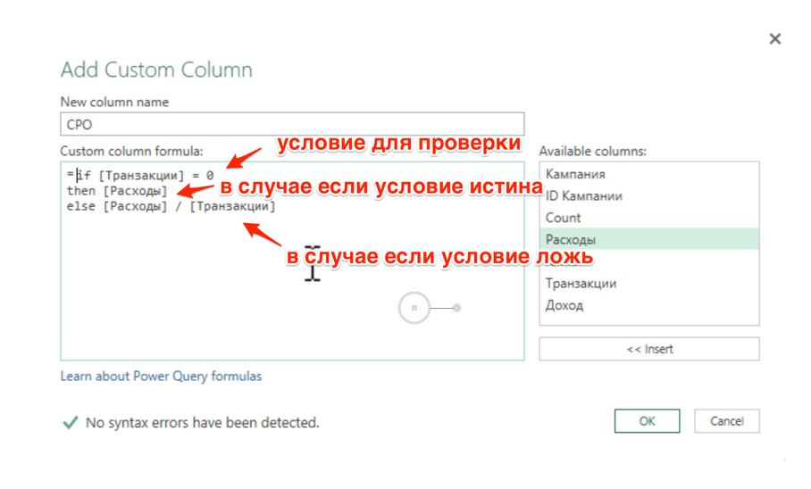

### Условный столбец (Conditional column)

Мастер добавления столбца с условным значением (условного столбца), формирует значение столбца согласно заданным правилам. Мастер добавления условного столбца можно найти в Power Query, на вкладке добавления столбца, как показано на скриншоте ниже.

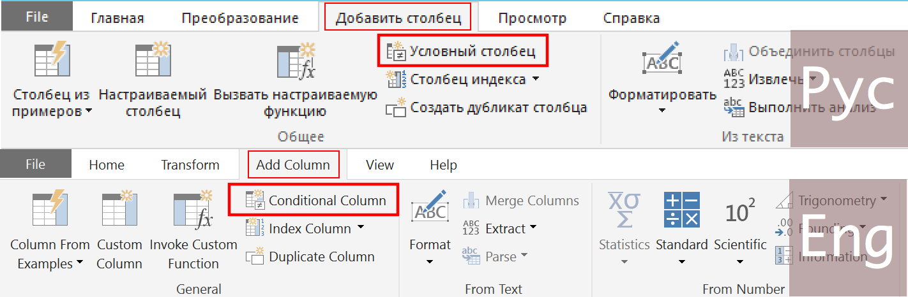

Пояснения к мастеру конфигурации условного столбца показаны на скриншоте ниже.


Для сведения - задаваемые условия в интерфейсе мастера пишут команду скрипта содержащего операторы `if then else`. Это значит, что первым будет проверено первое условие в мастере условного столбца. Все множество значений будет проверено по этому условию. В случае, если будут найдены результаты удовлетворяющие первому условию, то для них будет присвоено значение по результатам выполнения первого условия. Для остальных значений из множества, будет проверено следующее условие. И так далее, до тех пор, пока не будут проверенны все условия. Если для элементов множества не будет выполненно ни одно условие, то в условный столбец попадет значение из поля "В противном случае / (otherwise)".

При создании условий важно помнить, операции сравнения включающие type null и другие типы данных, возвращают ошибку в качестве результата. Подробнее об этом можно прочитать [в блоге у Максима Зеленского](http://excel-inside.pro/ru/blog/2018/05/17/%D1%81%D1%80%D0%B0%D0%B2%D0%BD%D0%B5%D0%BD%D0%B8%D0%B5-%D0%B7%D0%BD%D0%B0%D1%87%D0%B5%D0%BD%D0%B8%D0%B9-null-%D0%B2-power-query/)


### Изменение типа данных у столбца с текстового на десятичный, в случае если в качестве разделителя десятичной части используется точка вместо запятой

1. Необходимо щелкнуть правой кнопкой на заголовке столбца
2. Выбрать пункт «Change type»
3. И далее выбрать пункт «Using locale»
  
4. Выбираем страну, где в качестве разделителя используется точка (например, USA)
  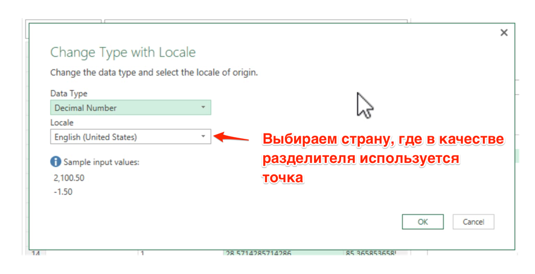

### Удалить дубликаты в столбцах

Команда "Remove Duplicates" проходит по выбранным столбцам (если выбрана вся таблица, то по всей таблице) и смотрит в них повторяющиеся ячейки (строчки, в случае если выбрана таблица). Если дубликаты найдены функция оставляет первую попавшуюся уникальную строчку и удаляет все последующие повторяющиеся Найти команду можно на Ribbon - Home - Remove Duplicates (Удалить дубликаты в выбранных столбцах)


Либо найти команду можно щелкнув правой кнопкой на заголовке одного или нескольких выбранных столбцов. В случае, если выбраны несколько столбцов, то тогда будут удалены все неуникальные сочетания значений в каждой отдельной строчке в выбранных столбцах.

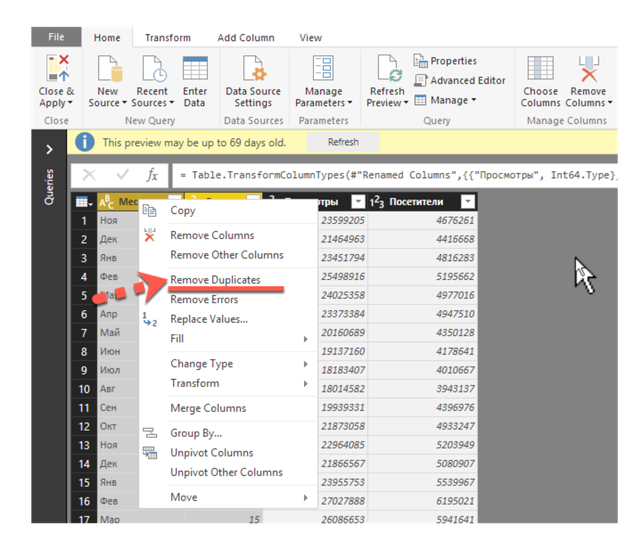

Удалить дубликаты строк в таблице можно нажав на кнопку в левом верхнем углу таблицы предпросмотра.

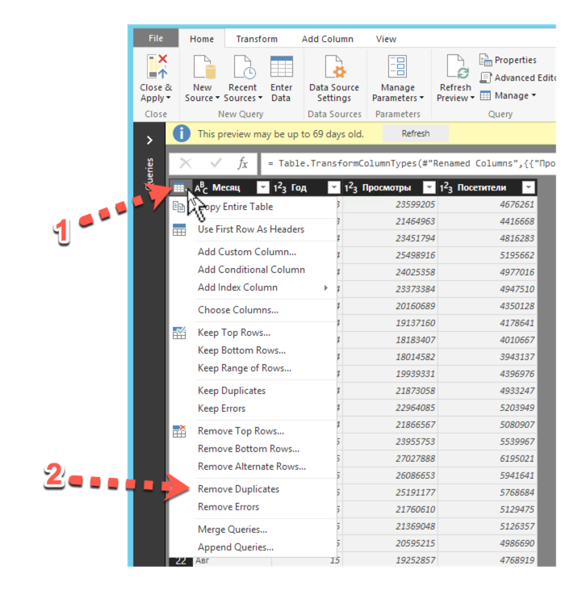

Аналогичного результата можно добиться если использовать команду "Group By"

### Count rows - Подсчитать количество строчек в текущей таблице


### Извлечение шагов в отдельный запрос

Для выполнения необходимо щелкнуть правой кнопкой на конкретном шаге обработки. Выбрать пункт меню «Extract previous steps»


ввести имя нового запроса, который будет создан на основе предыдущих шагов


### Функция Сохранить строки (Keep Top Rows)


### Функция Сохранить ошибки (Keer Errors)


### Функция Заменить ошибки в столбце (Replace Errors)

Функция доступна по нажатию правой кнопкой на заголовке столбца и позволяет заменить ошибки в столбце (например, получившиеся после применения нового типа данных) на выбранное значение. Обратите внимание, что по состоянию на 2019-07-29 функция доступна лишь при выборе одного столбца.


## Получение данных из различных источников

## Получение данных из файлов

### Получение данных из текстовых файлов (csv, tsv, txt и т.д.)

При получении данных [из текстового файла](assets/PQWizardCSV1.png) в Power Query открывается окно мастера настроек импорта файла. 


### Извлечение данных из файлов лежащих в папке

Выбираем в качестве типа источника папку. Далее выбираем конкретную папку с файликами, которые предполагается объединить. Файлики должны быть одного типа и с одинаковыми столбцами.


В появившемся окошке предпросмотра данных жмем на кнопочку edit.


## Получение данных из интернета

### Права доступа, Formula.Firewall

Текст взят из [Power bi formula firewall privacy settings - marketing-wiki.ru](http://marketing-wiki.ru/wiki/Power_bi_formula_firewall_privacy_settings)

При работе в Power BI, при обращении к внешним источникам данных вроде различных API могут возникать ошибки вроде: OLE DB or ODBC error: [information is needed in order to combine data]

или Formula.Firewall: Query is accessing data sources that have privacy levels which cannot be used together. Please rebuild this data combination

Это ошибки, которые возникают из-за встроенного в Power BI Fomrula.Firewall - механизма, который следит, чтобы данные из Power BI передавались только согласно выставленным правилам доступа.

то есть Power Bi пытается защитить нас, чтобы мы случайно не отправили какие-либо данные (вроде токена) на сервер-злоумышленника.

Однако, если мы работаем с API, то нам неминуемо нужно отправлять данные в интернет. Соответственно, чтобы не иметь проблем в этом процессе проще всего в настройках Power BI выключить Formula.Firewall. Это делается в разделе Privacy. Нужно выбрать 3-й пункт - "ignore privacy level settings"


## Символы разрыва строки

При помощи операции найти или для разделения ячейки на отдельные строчки можно воспользоваться символами `#(cr)#(lf)` либо воспользоваться функцией `Lines.FromText`


<iframe width="560" height="315" src="https://www.youtube.com/embed/gmB_EkrvY0c" frameborder="0" allow="accelerometer; autoplay; clipboard-write; encrypted-media; gyroscope; picture-in-picture" allowfullscreen></iframe>