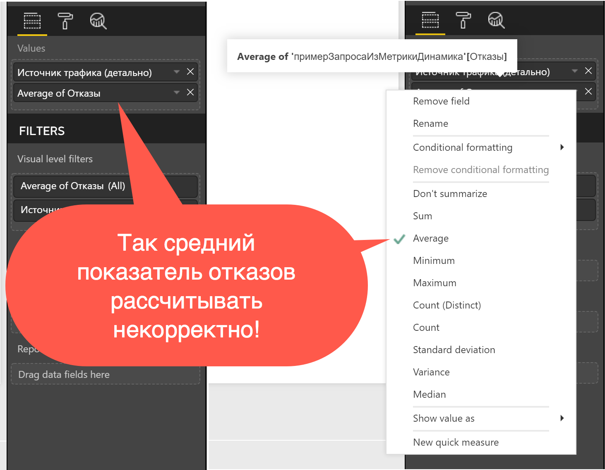
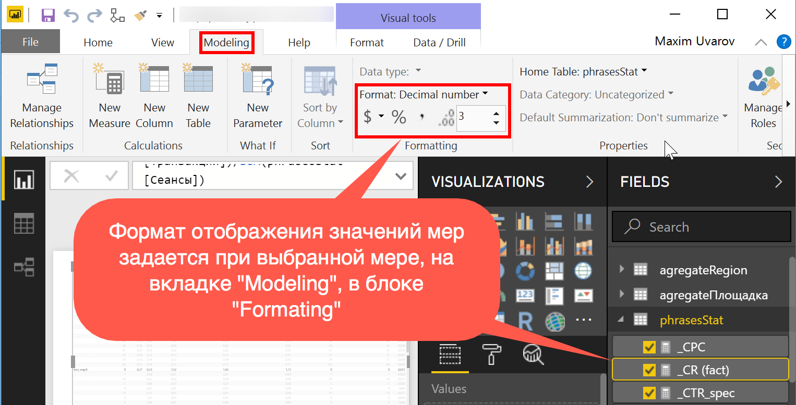
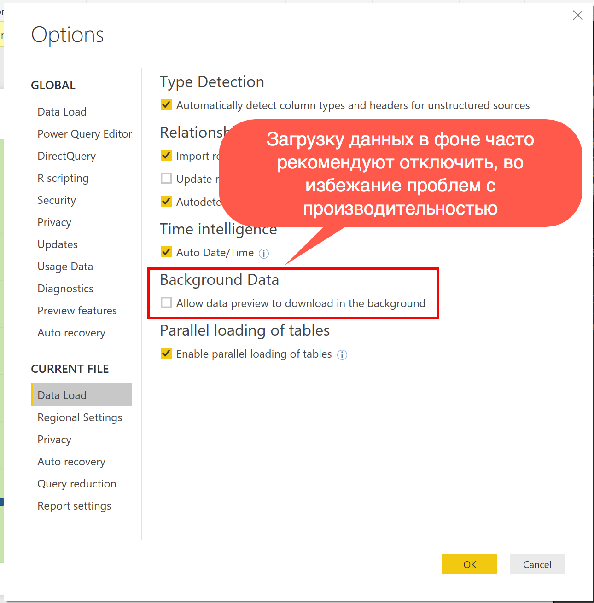

# Модель данных (язык Dax, расширение PowerPivot)

## Что такое Power Pivot в Excel

Power Pivot - это надстройка над Excel, представляющая из себя быструю колоночную базу данных VertiPaq с языком запросов DAX (часто вместо VertiPaq говорят Power Pivot). В отличие от Excel число строк загруженных в Power Pivot ограничено лишь размером доступной оперативной памяти компьютера. Быстродействие Power Pivot во много раз превосходит быстродействие формул в Excel. Также Power Pivot по производительности превосходит и Power Query (при этом часто он потребляет меньше ресурсов). Результаты выполнения запросов доступны пользователям в сводных таблицах и сводных диаграммах MS Excel. Таким образом сводные таблицы выступают аналитическим интерфейсом к данным хранящимся в Power Pivot.

## Что такое Power Pivot в Power BI

В Power BI Power Pivot встроен как база данных, к которой присоединяются различные визуализации.

## Что такое DAX

Dax (Data Analysis Expressions) - это язык программирования использующийся для запросов в базе данных VertiPaq.

## Модель данных

Модель данных - совокупность таблиц, связей между ними и вычисляемых мер в базе данных VertiPaq. Благодаря своей быстроте модель данных позволяет создавать мгновенно пересчитывающиеся меры, которые, в свою очередь, позволяют создавать интерактивные визуализации.

## Таблицы

Таблицы - совокупность строк, разделённых на столбцы.

У каждого столбца задан тип данных (который, как правило, наследуется из типов данных заданных для столбцов в Power Query).

У столбцов с числовыми типами данных можно увидеть значок сигмы Слева от них. И такие столбцы по умолчанию будут просуммированы, в случае если добавить их в область значений любой визуализации.


Если же добавить в область значений столбцы с не числовыми типами данных (без значка сигмы), то к ним будет применена операция по умолчанию: count (подсчет количества значений).

Список из таблиц загруженных в модель данных можно найти в дереве fields в правой части окна Power BI.


Каждая таблица имеет название, по которому к данным конкретной таблицы можно обращаться в мерах и вычисляемых столбцах. В случае если в названии таблицы присутствует пробел или не латинские символы, то при обращении к таблице извне её название заключается в одинарные кавычки автоматически:

`'название с пробелом'`

Однако, если мы заключим в кавычки название таблицы без пробелов, то все будет работать как предполагалось:

`'название'`

## Функции Dax

Функции языка Dax похожи на функции Excel, с той лишь разницей, что в качестве аргументов используют столбцы, целые таблицы или скалярные выражения (простые значения), а не ячейки.

В качестве разделителей аргументов в зависимости от локали используются:

- ";" (и "," для десятичных)
- "," (и "." для десятичных)

## Меры (Measures)

Вычисляются только в момент использования. Рассчитываются в рамках текущего контекста фильтров. Именно это свойство позволяет строить интерактивные визуализации, которые фильтруются при нажатии на определенные области конкретных визуализаций. Меры хоть и принадлежат конкретной таблице, но могут быть перенесены в любую другую таблицу в рамках документа. Поэтому хорошая практика при использовании мер формулах не включать название таблицы, в которо    й мера лежит. То есть вместо `'таблица'[мера]` писать просто `[мера]`.

## Быстрые меры (Quick Measures)

Функционал быстрых мер позволяет создавать сложные DAX формулы без написания кода. Вместо написания кода нужно сконфигурировать желаемую меру в графическом интерфейсе. Подробнее о быстрых мерах можно прочитать в справке по [Power BI](https://docs.microsoft.com/ru-ru/power-bi/desktop-quick-measures)

## Вычисляемые Столбцы (Calculated Columns)

Рассчитываются однажды во время обновления таблицы в модели данных. Вычисляемые столбцы занимают место в памяти. Вычисляемые столбцы рассчитываются в рамках контекста строки. В отличие от мер, вычисляемые столбцы могут использоваться для фильтрации и сортировки таблиц. Принадлежат конкретной таблице и их лучше указывать в формулах вместе с названием таблицы, даже если Power Pivot позволяет этого не делать.

Подробнее про столбцы и меры читать здесь:

- [Calculated Columns and Measures in DAX - SQLBI](http://www.sqlbi.com/articles/calculated-columns-and-measures-in-dax/)

## Контекст выполнения функции (Evaluation context)

В Power Pivot существуют два контекста выполнения формулы, которые действуют одновременно:

- Контекст фильтров (Filter context)
- Контекст строк (Row context)

Это массивная и сложная тема. На момент написания методички автор так и не разобрался с темой до того уровня, чтобы рассказывать об этом окружающим. Потому рекомендую обратиться к достоверным источникам вроде:

- Марко Руссо и Альберто Феррари <https://www.sqlbi.com/>.
- Справка Microsoft Power BI: [Основные сведения о DAX в Power BI Desktop](https://docs.microsoft.com/ru-ru/power-bi/desktop-quickstart-learn-dax-basics#context)

## Связь таблиц в модели данных

Для связи таблиц в модели данных в одной из таблиц в ключевом поле должны быть уникальные значения. Также столбцы должны быть одного типа данных.

Направление связи имеет значение. Вычисляемые столбцы могут использоваться для создания связей между таблицами.

Справка: [Создание связей и управление ими в Power BI Desktop - Power BI | Microsoft Docs](https://docs.microsoft.com/ru-ru/power-bi/desktop-create-and-manage-relationships)

## Связь таблиц по ключевому столбцу дата и time-intelligence функции

В случае, если в модели данных есть отдельная таблица-календарь (вроде [такой](https://gist.github.com/maxim-uvarov/d58cd21da4e486abc1408e4ae58f302d)), и если таблица с фактами связана с таблицей-календарем по полю дата, то для создания [быстрых мер](#Быстрые-меры-quick-measures) в поле дата нужно использовать столбец с датами из таблицы календаря. Столбец с датами из таблицы с фактами в быстрых мерах работать не будет.

## Часто используемые функции DAX

`SUM (Столбец)` - Cумма чисел по столбцу

`COUNTA (Столбец)` - Количество значений в столбце

`DISTINCTCOUNT (Столбец)` - Количество уникальных значений в столбце

`SUMX (Таблица, Выражение)` - Сумма значений выражения, которое выполняется для каждой строчки таблицы

`DIVIDE (Значение числителя, значение знаменателя, альтернативный вариант в случае ошибки деления числителя на знаменатель)` - Безопасное деление

`IFERROR (Значение, Значение если ошибка)` - Если ошибка

`IF (Логическое выражение, значение если правда, значение если ложь )` - Если

## Метрики контекстной рекламы в DAX

CTR (Кликабельность)

```
= SUM ( Клики ) / SUM ( Показы ) 
```

CPC (Цена клика)

```
= SUM ( Расход ) / SUM ( Клики )
```

Ставка (Максимальная цена клика установленная рекламодателем)

Ставка Средняя

```
= AVERAGE ( ставка )
```

Ставка СреднеВзвешенная на клики

```
= SUMX ( ставка * клики ) / SUM ( клики )
```

Ставка СреднеВзвешенная на показы

```
= SUMX ( ставка * показы ) / SUM (показы)
```

CR (Коэффициент конверсии фактический)

```
= SUM ( транзакции ) / SUM ( сессии )
```

Ключевая фраза: количество

```
= COUNTA ( ключевая фраза )
```

Ключевая фраза: количество уникальных

```
= DISTINCTCOUNT ( ключевая фраза )
```

## Про абсолютные и относительные метрики в выгрузках

Средний показатель отказов рассчитывается по формуле:

```
= SUM ( отказы ) / SUM ( визиты )
```

Если в выгрузке нет абсолютного числа ОТКАЗОВ, но есть ПОКАЗАТЕЛЬ ОТКАЗОВ, то для каждой строчки с исходными данными предварительно необходимо рассчитать абсолютное число ОТКАЗОВ. Для этого нужно умножить ПОКАЗАТЕЛЬ ОТКАЗОВ на ЧИСЛО ВИЗИТОВ. После этого у вас появится возможность рассчитывать средний показатель отказов корректно.

Аналогичным образом следует поступить с глубиной просмотра и временем на сайте.

Распространенная ошибка рассчитывать СРЕДНИЙ ПОКАЗАТЕЛЬ ОТКАЗОВ в качестве встроенной меры AVERAGE по столбцу ПОКАЗАТЕЛЬ ОТКАЗОВ (см скрин. <http://bit.ly/2JMKSl1>).



Так средний показатель отказов рассчитывать некорректно.

## Формат отображения чисел в мерах и столбцах

Формат отображения значений мер задается при выбранной мере, на вкладке "Modeling", в блоке "Formating"



## Полезные ресурсы по DAX

- [sqlbi.com/articles/calculated-columns-and-measures-in-dax/](http://www.sqlbi.com/articles/calculated-columns-and-measures-in-dax/)
- [powerpivotpro.com/2013/02/when-to-use-measures-vs-calc-columns/](http://www.powerpivotpro.com/2013/02/when-to-use-measures-vs-calc-columns/)
- [Клевый курс на udemy про Power Pivot](https://www.udemy.com/power-pivot-workshop-beginner/learn/v4/overview)
- [Книга: The Definitive Guide to DAX: Business intelligence with Microsoft Excel, SQL Server Analysis Services, and Power BI (Business Skills) 1st Edition](https://www.amazon.com/Definitive-Guide-DAX-intelligence-Microsoft/dp/073569835X/ref=asap_bc?ie=UTF8)
- [Daxpatterns.com](http://www.daxpatterns.com/)
- [Канал Curbal на youtube с подробными обучающими видео DAX Fridays](https://www.youtube.com/channel/UCJ7UhloHSA4wAqPzyi6TOkw)

# Настройки Power BI

## Фоновые данные - разрешить скачивание в фоне (Background data - allow data preview)

Загрузку данных в фоне часто рекомендуют отключить, во избежание проблем с производительностью. Ссылки по теме:

1. Параметр Allow Data Preview To Download In The Background в Power Query и Power BI - статья Криса Вебба: [перевод 🇷🇺](https://needfordata.ru/blog/%D0%BF%D0%B0%D1%80%D0%B0%D0%BC%D0%B5%D1%82%D1%80-allow-data-preview-to-download-in-the-background-%D0%B2-power-query-%D0%B8-power-bi), [оригинал 🇺🇲](https://blog.crossjoin.co.uk/2016/12/05/power-query-power-bi-and-the-allow-data-preview-to-download-in-the-background-option/).
2. Ветка, в предложения выключить эту настройку по умолчанию [uservoice](https://excel.uservoice.com/forums/304921-excel-for-windows-desktop-application/suggestions/20636248-change-default-settings-for-data-preview-in-backgr).
  
  


## Горячие клавиши окна редактирования DAX формул

### Базовое редактирование  

- `Ctrl+X` - Вырезать строку (Пустое выделение)  
- `Ctrl+C` - Скопировать строку (Пустое выделение)  
- `Alt+↑` - Перемещает текущую строку вверх / вниз  
- `Shift+Alt+↑` - Копирует строку и вставляет её выше / ниже  
- `Ctrl+Shift+K` - Удаляет строку  
- `Shift+Enter` - Добавить новую строку ниже под курсором  
- `Ctrl+]` - Увеличить / уменьшить отступ строки  
- `Tab` - Увеличить / уменьшить отступ строки  
- `Home` - Перейти в начало / конец строки  
- `Ctrl+Home` - Перейти в начало / конец DAX формулы  
- `Ctrl+K Ctrl+C` - Поставить / убрать однострочный комментарий  
- `Ctrl+/` - Поставить или убрать однострочный комментарий  
- `Shift+Alt+A` - Поставить или убрать многострочный комментарий  

### Навигация  

- `Ctrl+G` - Перейти к строке  
- `F8` - Перейти к ближайшей / следующей ошибке или предупреждению  

### Поиск и замена  

- `Ctrl+F2` - Найти и выделить все вхождения выбранного сегмента  
- `Ctrl+D` - Выделить слово под курсором целиком, при повторном нажатии выделяет аналогичные слова по тексту  
- `Ctrl+K Ctrl+D` - Перейти к следующему совпадающему выделению  
- `Shift-Esc` - снять выделение / убрать все курсоры и оставить один курсор  

### Мультикурсор и выделение  

- `Ctrl+A` - Выделить все  
- `Alt+Клик` - Добавить курсор к выделению  
- `Ctrl+Alt+↑` - Добавить мультикурсор выше / ниже  
- `Ctrl+U` - Убрать последнее выделение курсора  
- `Ctrl+F2` - Выделяет все вхождения слова  
- `Ctrl+Shift+L` - Выделяет все вхождения выделенного текста  
- `Shift+Alt+→` - Расширить / уменьшить текущее выделение по строке  

